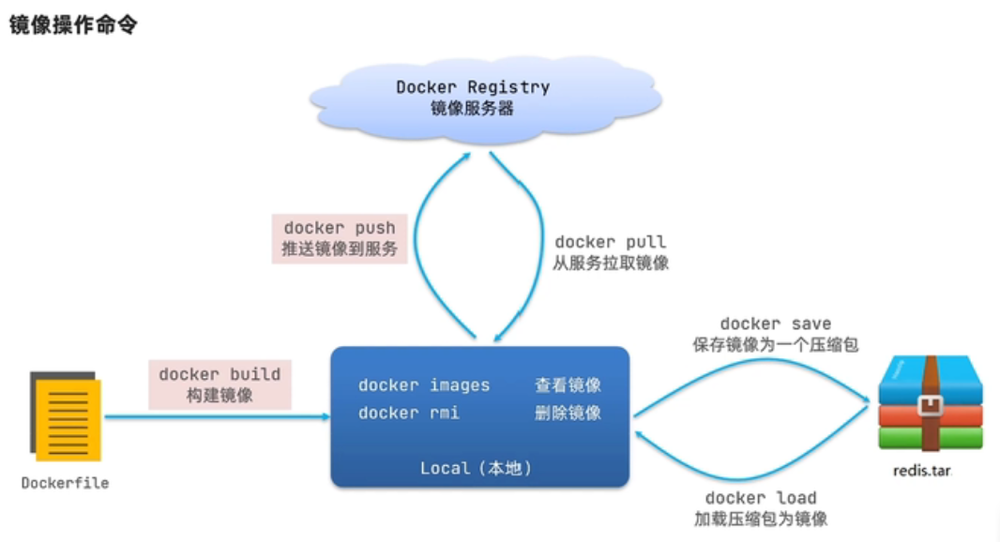

# docker

## 1 概述

## 2 安装

- Linux

- Windows

## 3 使用

- 镜像
	- 命令
	
	

	- 镜像结构
	
	

	- 自定义镜像
	- DockerCompose
	- 镜像仓库搭建
- 容器
- 数据卷
- 集群部署

## 4 jenkins

```
docker run ^
  --name jenkins ^
  -u root ^
  --rm ^
  -d ^
  -p 8082:8080 ^
  -v D:\dockervolumes\jenkins\jenkins-data:/var/jenkins_home ^
  -v D:\dockervolumes\jenkins\docker.sock:/var/run/docker.sock ^
  jenkinsci/blueocean:1.25.5-bcc31d32159f
```

