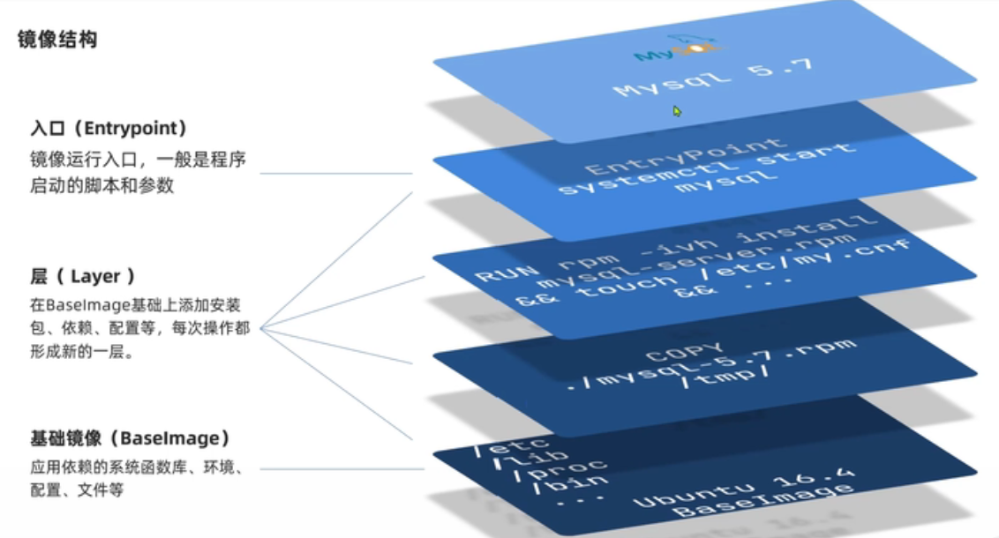
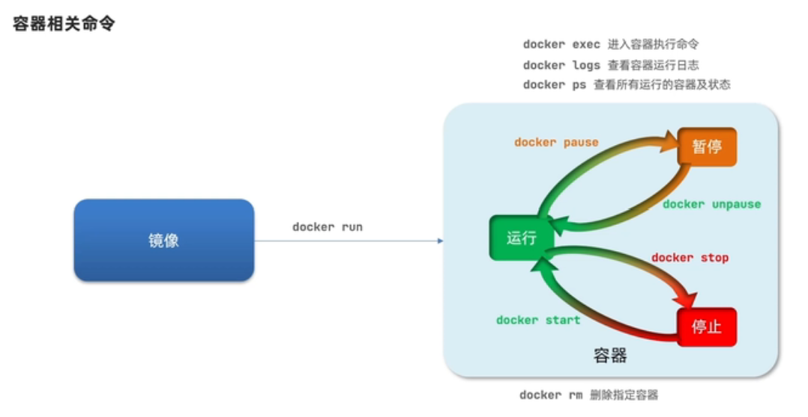
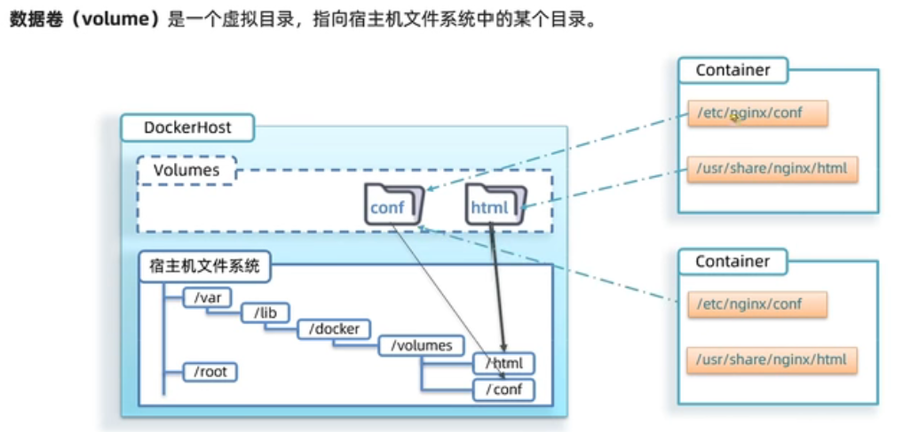

# docker

## 1 概述

- 历史
- 对比虚拟机

## 2 安装

- Linux

- Windows

## 3 使用

- 镜像、容器、数据卷: [官方文档](https://docs.docker.com/)
	
	<center class="half">
	
	</center>
		<center class="half">
	
	</center>

* Dockerfile文件，用于自定义镜像。 主要指令：`FROM` `ENV` `COPY` `RUN` `EXPOSE` `ENTRYPOINT`

	```
	# 指定基础镜像
	FROM ubuntu:16.0.4
	# 配置环境变量，JDK安装目录
	ENV JAVA_DIR=/usr/local
	# 拷贝JDK,项目JAR包到镜像内
	COPY ./jdk.jar.gz $JAVA_DIR
	# 安装JDK: 解压缩、重命名
	RUN cd $JAVA_DIR \
	    && tar -xf ./jdk.jar.gz \
	    && mv ./jdk1.8.0_144 ./java8
	# 配置环境变量
	ENV JAVA_HOME=$JAVA_DIR/java8
	ENV PATH=$PATH:$JAVA_HOME/bin

	## 由于是分层结构，可以直接从java镜像开始构建，效果是一样的
	#FROM java:8-alpine

	# 拷贝JDK,项目JAR包到镜像内
	COPY ./docker-demo.jar /tmp/app.jar
	# 暴露端口
	EXPOSE 8090
	# 入口，启动 JAVA项目
	ENTRYPOINT java -jar /tmp/app.jar
	```

- DockerCompose及镜像仓库搭建

	```yaml
	version: '3.0'
	services:
		registry:
			image: registry
			volumes:
				- D:\docker_volumes\registry:var/lib/registry
		ui:
			image: joxit/docker-registry-ui
			ports:
				- 8086:80
			environment:
				- REGISTRY_TITLE=我的私有仓库
				- REGISTRY_URL=http://registry:8080
			depends-on:
				- registry
	```

- 集群部署

## 4 jenkins

```
docker run ^
  --name jenkins ^
  -u root ^
  --rm ^
  -d ^
  -p 8082:8080 ^
  -v D:\dockervolumes\jenkins\jenkins-data:/var/jenkins_home ^
  -v D:\dockervolumes\jenkins\docker.sock:/var/run/docker.sock ^
jenkinsci/blueocean:1.25.5-bcc31d32159f
```

## 5 gitlab

```
docker run -d ^
  -p 8008:80 ^
  -p 8009:443 ^
  -p 8010:22 ^
  --name gitlab ^
  -v D:\dockervolumes\gitlab\etc\gitlab:/etc/gitlab ^
  -v D:\dockervolumes\gitlab\var\log\gitlab:/var/log/gitlab ^
  -v D:\dockervolumes\gitlab\var\opt\gitlab:/var/opt/gitlab ^
  --privileged=true ^
gitlab/gitlab-ce
```	