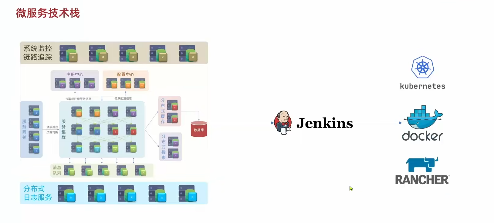
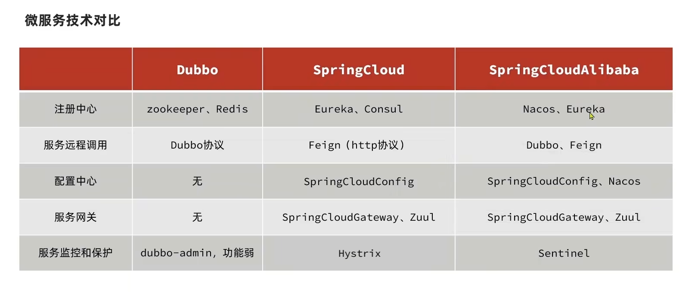

# 概述

## 1. 架构演变

- 单体架构

 将业务的所有功能集中在一个项目中开发，打成一个包部署。

- 分布式架构

 根据业务功能对系统进行拆分，每个业务模块作为一个独立项目开发，称为一个服务。 
 服务拆分之后需要解决各种问题，称为***服务治理***

- CAP原则：在一个分布式系统中，这三个要素最多只能同时实现两点，不可能三者兼顾。
  - 一致性（Consistency）
  - 可用性（Availability）
  - 分区容错性（Partition tolerance）
  
    - 分布式系统网络拓扑结构因故障形成多个不连通的子图，即分区；
    - 不同数据是不能跨分区做交换的，能够应对分区问题的特性即分区容错性;
    - 应对分区最常见的办法是数据备份。

  因分区这种故障很严重，故分布式系统常常需要满足**P**性质,也即分布式系统一般有**AP**,**CP**两种实现方式。

- 微服务架构

 一种经过良好架构设计的分布式架构方案。
 

## 2. 相关技术

- 落地

 微服务架构需要各种技术框架实现落地。目前比较主流的有***SpringCloud***和***Dubbo***。
 
