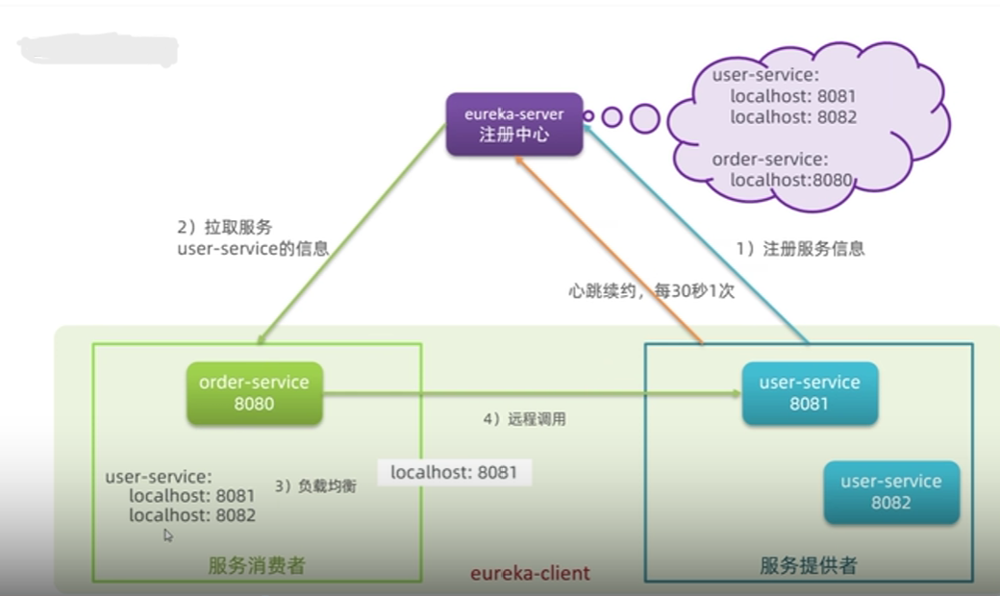

# SpringCloud

## 1 官方

SpringCloud集成了各种微服务功能组件，并基于SpringBoot实现了这些组件的自动装配，从而提供了良好的开箱即用体验。<br>
二者的版本兼容[springcloud官网](https://spring.io/projects/spring-cloud)给出了

## 2 注册中心

### 2.1 原理

<!--  -->


+ 服务注册和服务发现：
	+ 服务提供者启动时向 eureka 注册自己的信息
	+ eureka 保存这些信息
	+ 消费者根据服务名称向 eureka 定时拉取提供者信息
+ 消费者如何选择服务实例：
	+ 负载均衡算法
+ 健康检查：
	* 服务提供者定时向 EurekaServe 发送心跳
	* eureka 根据心跳更新服务列表，剔除心跳不正常的

### 2.2 Eureka

例子给的是单体配置，配置 eureka 集群参考[eureka集群](https://www.jianshu.com/p/5d5b2cf7d476)

* 搭建 EurekaServer
	* 引入 eureka-server 依赖
		```
	    <dependency>
	      <groupId>org.springframework.cloud</groupId>
	      <artifactId>spring-cloud-starter-netflix-eureka-server</artifactId>
	    </dependency>
		```
	* 添加`@EnableEurekaServer`自动装配
	* yml 中添加相关配置
		```
		server:
		  port: 8761 # 8761是eureka server的默认端口
		eureka:
		  server:
		    enable-self-preservation: false #防止由于Eureka的机制导致Client被错误显示在线 仅在开发环境使用
		  client:
		    service-url:
		      defaultZone: http://localhost:8761/eureka/ #这便是此eureka server的应用注册地址
		    register-with-eureka: false #不显示对server应用的注册
		spring:
		  application:
		    name: eureka-demo
		```
* 服务注册和服务发现
	* 引入 eureka-client 依赖	
		```
		<dependency>
	    <groupId>org.springframework.cloud</groupId>
	    <artifactId>spring-cloud-starter-netflix-eureka-client</artifactId>
	    </dependency>
		```
	* yml 中添加相关配置	
		```
		server:
		  port: 8081
		eureka:
		  client:
		    service-url:
		      defaultZone: http://localhost:8761/eureka/ #注册到刚才那台Eureka Server地址
		spring:
		  application:
		    name: client-0
		```

	* 给 RestTemplate 添加`@LoadBalanced`注解
	* 用服务提供者的服务名称替换硬编码的ip进行远程调用

### 2.3 Nacos

- 安装并启动服务端
	- 从[Nacos官网](https://nacos.io/zh-cn/)进到*github*仓库下载对应版本的压缩包解压即可<br>
		*Nacos*是*java*语言编写的，默认端口是8848<br>
	- 进到*bin*目录下通过命令行`startup.cmd -m standalone`单点启动*nacos-server*
	
- 服务注册和服务发现

	由于*nacos*实现了*springcloud commons*中的标准接口，使用上与*eureka*没有太大差异

	* 替换 eureka-client 依赖	
		```
		<dependency>
	    <groupId>com.alibaba.cloud</groupId>
	    <artifactId>spring-cloud-starter-alibaba-nacos-discovery</artifactId>
	    </dependency>
		```
	* yml 中添加相关配置	
		```
		server:
		  port: 8081
		spring:
		  application:
		    name: client-0
		  cloud:
		  	nacos:
		  		server-addr: localhost:8848
		```

- 分级存储模型——环境隔离——*NacosRule* 负载均衡

	*group*是概念上的分组，可以把相关度高的服务放到一个组；集群一般按地域划分

	- *namespace* : *group* : 服务名：集群名：实例
	- 每个*namespace*都有一个唯一*id*,不同*namespace*下的服务不能相互访问
	
	适配分级存储模型，实现了相应的负载均衡规则

	- 优先拉取同集群下的服务列表，之后随机访问实例
	- *nacos*可以配置服务实例的权重，可以做安全下线，灰度发布

### 2.4 Eureka 和 Nacos 的不同

|          | Eureka                                 | Nacos                                                                         |
|----------|----------------------------------------|-------------------------------------------------------------------------------|
| 服务发现 | 消费者定时拉取                         | 消费者定时拉取+心跳异常推送                                                   |
| 健康检查 | 服务提供者定时发送心跳<br>心跳异常剔除服务 | 临时实例：同Eureka<br>非临时实例：nacosserver主动定时询问，不健康时仅作标记不剔除 |
| 负载均衡 | Ribbon                                 | NacosRule                                                                     |