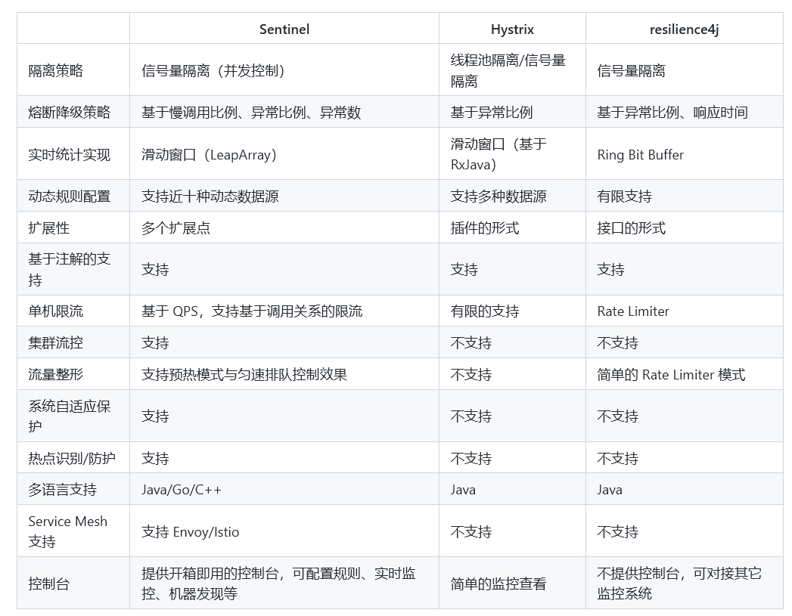

# SpringCloud

## 1 官方

SpringCloud集成了各种微服务功能组件，并基于SpringBoot实现了这些组件的自动装配，从而提供了良好的开箱即用体验。<br>
二者的版本兼容[springcloud官网](https://spring.io/projects/spring-cloud)给出了

## 2 注册中心

### 2.1 原理

<!--  -->


+ 服务注册和服务发现：
	+ 服务提供者启动时向 eureka 注册自己的信息
	+ eureka 保存这些信息
	+ 消费者根据服务名称向 eureka 定时拉取提供者信息
+ 消费者如何选择服务实例：
	+ 负载均衡算法
+ 健康检查：
	* 服务提供者定时向 EurekaServe 发送心跳
	* eureka 根据心跳更新服务列表，剔除心跳不正常的

### 2.2 Eureka

例子给的是单体配置，配置 eureka 集群参考[eureka集群](https://www.jianshu.com/p/5d5b2cf7d476)

* 搭建 EurekaServer
	* 引入 eureka-server 依赖
		```
	    <dependency>
	      <groupId>org.springframework.cloud</groupId>
	      <artifactId>spring-cloud-starter-netflix-eureka-server</artifactId>
	    </dependency>
		```
	* 添加`@EnableEurekaServer`自动装配
	* application.yml 中添加相关配置
		```
		server:
		  port: 8761 # 8761是eureka server的默认端口
		eureka:
		  server:
		    enable-self-preservation: false #防止由于Eureka的机制导致Client被错误显示在线 仅在开发环境使用
		  client:
		    service-url:
		      defaultZone: http://localhost:8761/eureka/ #这便是此eureka server的应用注册地址
		    register-with-eureka: false #不显示对server应用的注册
		spring:
		  application:
		    name: eureka-demo
		```
* 服务注册和服务发现
	* 引入 eureka-client 依赖	
		```
		<dependency>
	    <groupId>org.springframework.cloud</groupId>
	    <artifactId>spring-cloud-starter-netflix-eureka-client</artifactId>
	    </dependency>
		```
	* application.yml 中添加相关配置	
		```
		server:
		  port: 8081
		eureka:
		  client:
		    service-url:
		      defaultZone: http://localhost:8761/eureka/ #注册到刚才那台Eureka Server地址
		spring:
		  application:
		    name: client-0
		```

	* 给 RestTemplate 添加`@LoadBalanced`注解
	* 用服务提供者的服务名称替换硬编码的ip进行远程调用

### 2.3 Nacos

- 安装并启动服务端
	- 从[Nacos官网](https://nacos.io/zh-cn/)进到*github*仓库下载对应版本的压缩包解压即可<br>
		*Nacos*是*java*语言编写的，默认端口是8848<br>
	- 进到*bin*目录下通过命令行`startup.cmd -m standalone`单点启动*nacos-server*
	
- 服务注册和服务发现

	由于*nacos*实现了*springcloud commons*中的标准接口，使用上与*eureka*没有太大差异

	* 替换 eureka-client 依赖	
		```
		<dependency>
	    <groupId>com.alibaba.cloud</groupId>
	    <artifactId>spring-cloud-starter-alibaba-nacos-discovery</artifactId>
	    </dependency>
		```
	* application.yml 中添加相关配置	
		```
		server:
		  port: 8081
		spring:
		  application:
		    name: client-0
		  cloud:
		  	nacos:
		  		server-addr: localhost:8848
		```

- 分级存储模型——环境隔离——*NacosRule* 负载均衡

	*group*是概念上的分组，可以把相关度高的服务放到一个组；集群一般按地域划分

	- *namespace* : *group* : 服务名：集群名：实例
	- 每个*namespace*都有一个唯一*id*,不同*namespace*下的服务不能相互访问
	
	适配分级存储模型，实现了相应的负载均衡规则

	- 优先拉取同集群下的服务列表，之后随机访问实例
	- *nacos*可以配置服务实例的权重，可以做安全下线，灰度发布

- *Nacos*作为配置中心
	- *Quikstart*
		- *Nacos*控制台添加相关配置
		- 添加依赖	
			```
			<dependency>
	    	<groupId>com.alibaba.cloud</groupId>
	    	<artifactId>spring-cloud-starter-alibaba-nacos-config</artifactId>
	    	</dependency>
			```
		- bootstrap.yml 中添加相关配置	
			```
			spring:
		  	application:
		    	name: client-0
		    profiles:
		    	active: dev
		  	cloud:
		  		nacos:
		  			server-addr: localhost:8848
		  			config:
		  				file-extension: yaml
			```
		- 配置热更新——多环境共享配置
			- `@Value`结合`@RrefreshScope`
			- `@ConfigurationProperties`
			- 多环境共享配置下配置生效优先级：
			
			  	服务名-profile.yaml > 服务名.yaml > 本地配置

	- 集群部署
	
		

### 2.4 Eureka 和 Nacos 的不同

|          | Eureka                                 | Nacos                                                                         |
|----------|----------------------------------------|-------------------------------------------------------------------------------|
| 服务发现 | 消费者定时拉取                         | 消费者定时拉取+心跳异常推送                                                   |
| 健康检查 | 服务提供者定时发送心跳<br>心跳异常剔除服务 | 临时实例：同Eureka<br>非临时实例：nacosserver主动定时询问，不健康时仅作标记不剔除 |
| 负载均衡 | Ribbon                                 | NacosRule                                                                     |

## 3 远程调用

### 3.1 Feign

* *Quikstart*
	* 添加客户端依赖	
		```
		<dependency>
    	<groupId>com.springframework.cloud</groupId>
    	<artifactId>spring-cloud-starter-openfeign</artifactId>
    	</dependency>
		```
	* 启动类上添加注解`@EnableFeignClients` ，客户端上添加`@FeignClient`
	* 基于*SpringMVC*注解声明远程调用信息
	* *feign*集成了*ribbon*做负载均衡

* 自定义配置——性能优化
	- *feign*底层客户端实现
		- URLConnection: 默认实现，不支持连接池
		- Apache HttpClient: 支持连接池
		- OKHttp: 支持连接池
	- 改为带连接池的实现
	- 日志级别改为*none*或者*basic*

		```
		<dependency>
    	<groupId>io.github.openfeign</groupId>
    	<artifactId>feign-httpclient</artifactId>
    	</dependency>
		```

		```
		feign:
	  		client:
		    	config:
		    		default: #全局
		    			loggerLevel: BASIC
		    httpClient:
		    	enabled: true
		    	max-connections: 200
		    	max-connections-per-route: 50
		```

		最佳连接数可通过*JMeter*测试确定

- 最佳实践
	- 服务提供者的*Controller*接口和服务调用者的客户端声明实现同一个接口
	- 把调用服务需要的客户端声明、配置信息及需要的*POJO*统一抽取成一个模块，使用者需要引入此模块作为依赖
		
		这种方式*spring*扫描不到，需指定扫描路径或者特定类文件
		```
		@EnableFeignClients(basePackages = "com.example.feign.clients")
		@EnableFeignClients(clients = {Client1.class})
		```

## 4. 网关

### 4.1 概述

- 网关需要实现的功能
	- 身份认证、权限检验
	- 请求路由、负载均衡
	- 服务限流
- 技术实现
	- Zuul: 基于Servelet实现，属于阻塞式编程
	- SpringCloudGateway: 基于*Spring5*提供的*WebFlux*，属于响应式编程

### 4.2 SpringCloudGateway

* *Quikstart-创建网关模块*
	* 添加客户端依赖	
		```
    	<dependency>
	    <groupId>com.alibaba.cloud</groupId>
	    <artifactId>spring-cloud-starter-alibaba-nacos-discovery</artifactId>
	    </dependency>

	    <dependency>
    	<groupId>com.springframework.cloud</groupId>
    	<artifactId>spring-cloud-starter-gateway</artifactId>
    	</dependency>
		```
	* 添加*nacos*和路由配置
		```
		server:
		  port: 8081
		spring:
		  application:
		    name: client-0
		  cloud:
		  	nacos:
		  		server-addr: localhost:8848
		  	gateway:
		  		routes:
		  			- id: userservice # 自定义，保持唯一即可
		  			  # url: http://localhost:8081 # 路由目标地址 写死，不推荐
		  			  url: lb://userservice # 路由目标地址 lb代表负载均衡，后面跟服务名
		  			  predicates: # 路由断言
		  			  	- Path=/user/** 

		```
+ ***路由断言工厂*** VS ***路由过滤器工厂*** VS ***全局过滤器***
	
	- 两个工厂负责解析对应配置文件中的*k-v*值；**路由断言工厂**处理路由、负载均衡；**路由过滤器工厂**有30+，见[官方文档](https://docs.spring.io/spring-cloud-gateway/docs/current/reference/html/#gatewayfilter-factories)
	- **全局过滤器**和两个工厂相比可以实现定制化需求
	
		```
		@Component
		public class CustomGlobalFilter implements GlobalFilter, Ordered {

		    @Override
		    public Mono<Void> filter(ServerWebExchange exchange, GatewayFilterChain chain) {
		        log.info("custom global filter");	//定制化,不是 serveletApi,基于 webflus
		        return chain.filter(exchange);
		    }

		    @Override
		    public int getOrder() {
		        return -1;
		    }
		}
		```

	- 过滤器执行顺序
	
		说明：请求路由确定后，经由相关适配器形成一个过滤器链；<br>
		　　　**路由过滤器工厂**中有一个类别是*default-filters*，针对所有路由生效；

		- 首先根据*Ordered*接口设定的*order*值排序
		- 过滤器工厂类的*order*值由*spring*指定；从1开始按配置顺序计数；*default-filters*和其他种类分开计数
		- *order*值相同时：*default-filters* > 其他工厂类过滤器 > **全局过滤器**

* 跨域问题处理
	- 跨域：（域名：端口号）不一致的两个域之间的访问
	- 问题原因：浏览器禁止请求发起者与服务端之间发生跨域*ajax*请求，请求被浏览器拦截
	- 解决方法：[CORS](https://www.jianshu.com/p/f5a88983f42d), *gateway*服务端需要添加配置支持

		```yaml
		spring:
		  cloud:
		    gateway: # 全局处理
		      globalcors:
		      	add-to-simple-url-handler-mapping: true # 解决 options 请求被拦截
		        cors-configurations:
		          '[/**]': # 匹配所有
		            allowedOrigins: # 允许的请求
		            - "https://docs.spring.io" 
		            allowedMethods: # 允许的方法
		            - GET
		            allowedHeaders: "*" # 允许在请求中携带的头信息
		            allowedCredentials: true # 是否允许携带 cookie
		            maxAge: 360000 # 一次检测的有效期 单位s
		```

## 4. 服务监控和保护
### 4.1 概述
- 雪崩问题：微服务直接相互调用，因为调用链中的一个服务故障，引起整个链路都无法访问的情况。
	+ 超时处理：设定超时时间，请求超过一定时间没有响应就返回错误信息，不会无休止等待。
	+ 舱壁模式：限定每个业务能使用的线程数，避免耗尽整个tomcat资源。
		* 线程隔离：支持主动超时、异步调用；额外开销较大；适合低扇出场景。
		* 信号量隔离：轻量；不支持主动超时、异步调用；适合高扇出场景。
	+ 熔断降级：由断路器统计业务执行的异常比例，如果超出阈值则会熔断该业务，拦截访问该业务的一切请求。
	+ 流量控制：限制业务访问的QPS，避免服务因流量突增而故障。
- 相关技术对比：Hystrix已经宣布停止维护。

### 4.2 sentinel
- [官网网站](https://sentinelguard.io/zh-cn/)
- QuikStart
	+ 安装dashboard:去[官方github](https://github.com/alibaba/Sentinel)下载jar包并运行，启动参数等参考官方文档
	+ 客户端引入相关依赖、配置sentinel控制台地址
	
		```
		<dependency>
            <groupId>com.alibaba.cloud</groupId>
            <artifactId>spring-cloud-starter-alibaba-sentinel</artifactId>
        </dependency>
		```

		```
		spring.cloud.sentinel.transport.dashboard=192.168.1.112:8081
		```

	+ 启用feign对sentinel的支持，编写FeignClient降级逻辑
	
		```
		feign.sentinel.enabled=true
		```

	+ 规则持久化：基于源码改造成push模式，[改造详解](https://github.com/zzpandaman/sentinel-1.8.3-push)
		* `csp.sentinel.app.type`配置项区分普通客户端和网关客户端，两着引入不同依赖。
		
			```
			<!-- 普通客户端  -->
	        <dependency>
	            <groupId>com.alibaba.csp</groupId>
	            <artifactId>sentinel-datasource-nacos</artifactId>
	        </dependency>
			```		

			```
			<!-- 网关客户端 -->
	        <dependency>
	            <groupId>com.alibaba.csp</groupId>
	            <artifactId>sentinel-datasource-nacos</artifactId>
	        </dependency>

	        <dependency>
	            <groupId>com.alibaba.cloud</groupId>
	            <artifactId>spring-cloud-alibaba-sentinel-gateway</artifactId>
	        </dependency>
			```
		
- 常用规则
	+ 簇点链路：就是项目内的调用链路，链路中**被监控的每个接口**就是一个资源。默认情况下sentinel会监控SpringMVC的每一个端点(Endpoint)。
	+ 自定义资源：`@SentinelResource`,链路模式下关闭context整合。
	+ 授权规则
	+ 自定义异常

