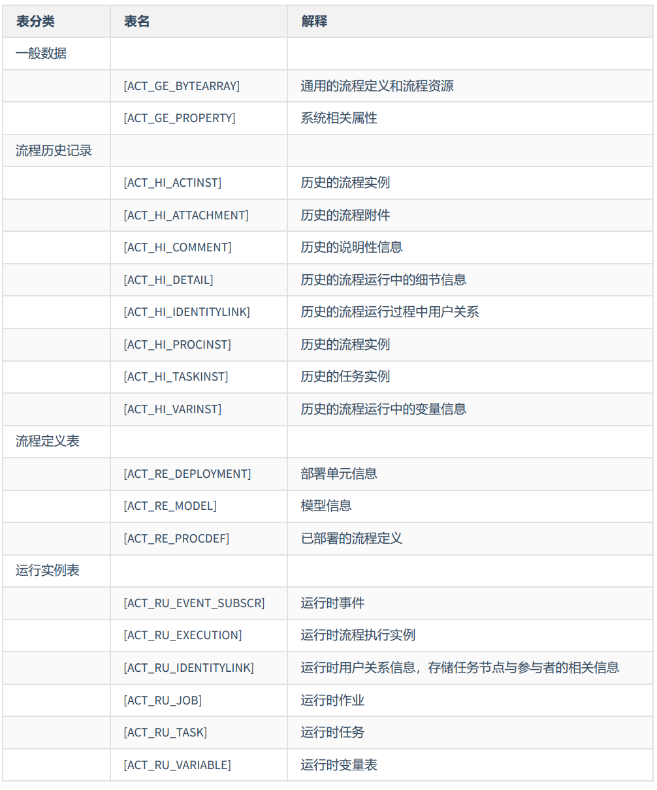
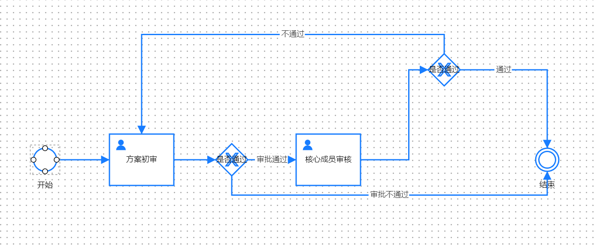
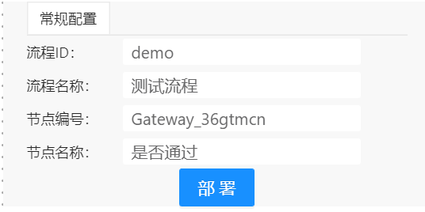
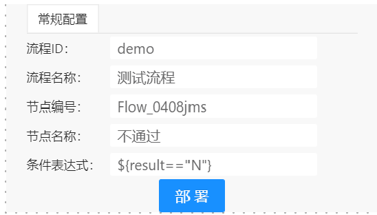
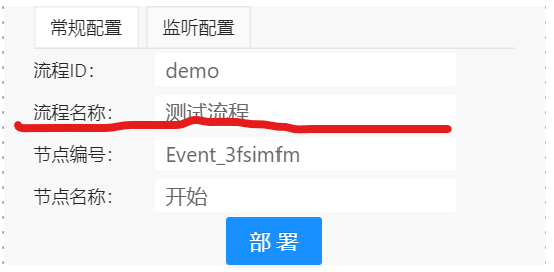
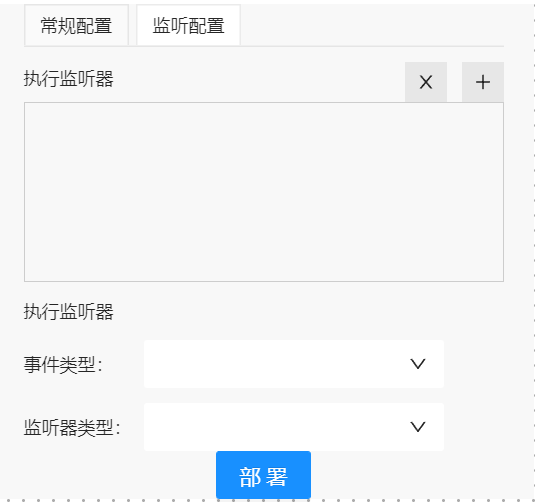
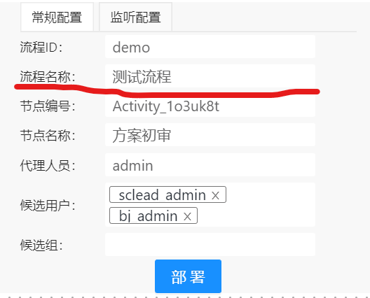
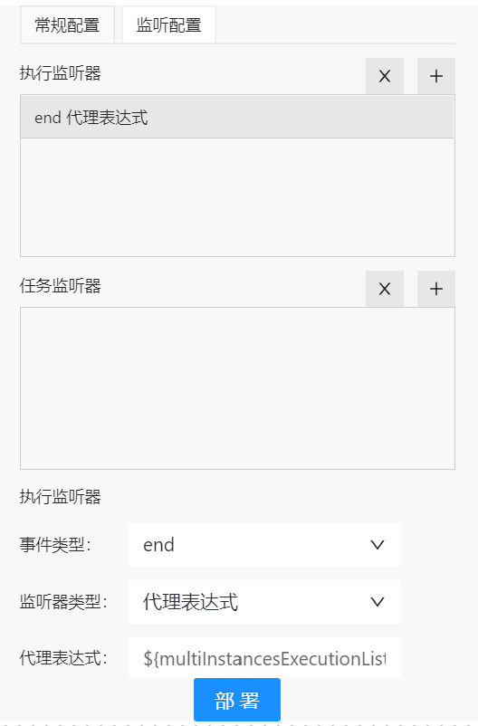
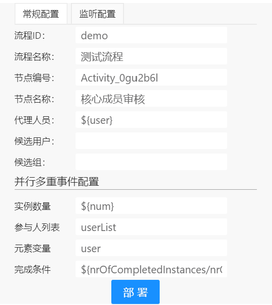
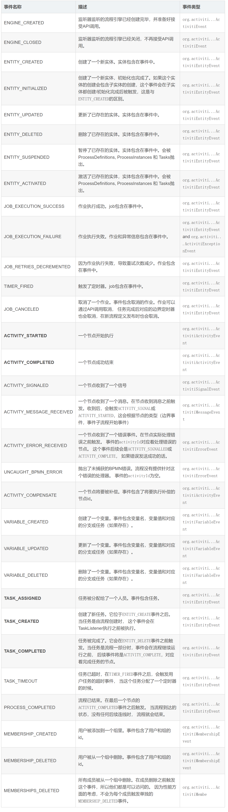

# activiti


## 1 表



## 2 流程图和xml

<details>
  <summary> 2.1 完整的配置</summary>

  

  ```xml
  <bpmn:definitions id="Definitions_0296ghe" xmlns:xsi="http://www.w3.org/2001/XMLSchema-instance" xmlns:bpmn="http://www.omg.org/spec/BPMN/20100524/MODEL" xmlns:bpmndi="http://www.omg.org/spec/BPMN/20100524/DI" xmlns:dc="http://www.omg.org/spec/DD/20100524/DC" xmlns:di="http://www.omg.org/spec/DD/20100524/DI" xmlns:activiti="http://activiti.org/bpmn" targetNamespace="http://bpmn.io/schema/bpmn" exporter="bpmn-js (https://demo.bpmn.io)" exporterVersion="7.3.0"> 
   <bpmn:process id="demo" isExecutable="true" name="测试流程"> 

    <bpmn:startEvent id="Event_3fsimfm" name="开始">  
     <bpmn:outgoing>Flow_3u62ed5</bpmn:outgoing>  
    </bpmn:startEvent>  
      
    <bpmn:userTask id="Activity_1o3uk8t" name="方案初审" activiti:assignee="admin" activiti:candidateUsers="sclead_admin,bj_admin"> 
      <bpmn:extensionElements>  
        <activiti:executionListener delegateExpression= "${multiInstancesExecutionListener}" event= "end"/>
      </bpmn:extensionElements> 
      
      <bpmn:incoming>Flow_3u62ed5</bpmn:incoming> 
      <bpmn:incoming>Flow_0408jms</bpmn:incoming> 
      <bpmn:outgoing>Flow_3c69mof</bpmn:outgoing> 
    </bpmn:userTask>  
      
    <bpmn:userTask id="Activity_0gu2b6l" name="核心成员审核" activiti:assignee="${user}"> 
      <bpmn:multiInstanceLoopCharacteristics activiti:collection="userList" activiti:elementVariable="user">  
        <bpmn:loopCardinality xsi:type="bpmn:tFormalExpression">${num}</bpmn:loopCardinality> 
        <bpmn:completionCondition xsi:type="bpmn:tFormalExpression">${nrOfCompletedInstances/nrOfInstances == 1}
        </bpmn:completionCondition> 
      </bpmn:multiInstanceLoopCharacteristics>  
      <bpmn:extensionElements>  
       <activiti:executionListener  delegateExpression= "${multiInstancesExecutionListener}" event= "start" />  
       <activiti:taskListener  delegateExpression= "${multiInstancesTaskListener}" event= "complete" /> 
      </bpmn:extensionElements> 

      <bpmn:incoming>Flow_03r2oq3</bpmn:incoming> 
      <bpmn:outgoing>Flow_2s9uult</bpmn:outgoing> 
    </bpmn:userTask>  

    <bpmn:endEvent id="Event_33qnlot" name="结束">  
      <bpmn:incoming>Flow_09ni4mm</bpmn:incoming> 
      <bpmn:incoming>Flow_1n6sooe</bpmn:incoming> 
    </bpmn:endEvent>  
      
    <bpmn:exclusiveGateway id="Gateway_36gtmcn" name="是否通过">  
      <bpmn:incoming>Flow_3c69mof</bpmn:incoming> 
      <bpmn:outgoing>Flow_09ni4mm</bpmn:outgoing> 
      <bpmn:outgoing>Flow_03r2oq3</bpmn:outgoing> 
    </bpmn:exclusiveGateway>  
      
    <bpmn:exclusiveGateway id="Gateway_16v387o" name="是否通过">  
      <bpmn:incoming>Flow_2s9uult</bpmn:incoming> 
      <bpmn:outgoing>Flow_0408jms</bpmn:outgoing> 
      <bpmn:outgoing>Flow_1n6sooe</bpmn:outgoing> 
    </bpmn:exclusiveGateway>  
      
    <bpmn:sequenceFlow id="Flow_3u62ed5" sourceRef="Event_3fsimfm" targetRef="Activity_1o3uk8t" />  

    <bpmn:sequenceFlow id="Flow_3c69mof" sourceRef="Activity_1o3uk8t" targetRef="Gateway_36gtmcn" />  

    <bpmn:sequenceFlow id="Flow_09ni4mm" sourceRef="Gateway_36gtmcn" targetRef="Event_33qnlot" name="审批不通过">  
      <bpmn:conditionExpression xsi:type="bpmn:tFormalExpression">${pass==0}</bpmn:conditionExpression> 
    </bpmn:sequenceFlow>  

    <bpmn:sequenceFlow id="Flow_03r2oq3" sourceRef="Gateway_36gtmcn" targetRef="Activity_0gu2b6l" name="审批通过">  
      <bpmn:conditionExpression xsi:type="bpmn:tFormalExpression">${pass==1}</bpmn:conditionExpression> 
    </bpmn:sequenceFlow>  

    <bpmn:sequenceFlow id="Flow_2s9uult" sourceRef="Activity_0gu2b6l" targetRef="Gateway_16v387o" />

    <bpmn:sequenceFlow id="Flow_0408jms" sourceRef="Gateway_16v387o" targetRef="Activity_1o3uk8t" name="不通过"> 
      <bpmn:conditionExpression xsi:type="bpmn:tFormalExpression">${result=="N"}</bpmn:conditionExpression>
    </bpmn:sequenceFlow>  
      
    <bpmn:sequenceFlow id="Flow_1n6sooe" sourceRef="Gateway_16v387o" targetRef="Event_33qnlot" name="通过">
      <bpmn:conditionExpression xsi:type="bpmn:tFormalExpression">${result=="Y"}</bpmn:conditionExpression>
    </bpmn:sequenceFlow>  

   </bpmn:process>  

   <bpmndi:BPMNDiagram id="BPMNDiagram_1">节点位置信息</bpmndi:BPMNDiagram> 
  </bpmn:definitions>
  ```

</details>

<details>
  <summary> 2.2 互斥网关</summary>

  <center class="half">
     
  </center>

  ```xml
  <bpmn:definitions id="Definitions_0296ghe" xmlns:xsi="http://www.w3.org/2001/XMLSchema-instance" xmlns:bpmn="http://www.omg.org/spec/BPMN/20100524/MODEL" xmlns:bpmndi="http://www.omg.org/spec/BPMN/20100524/DI" xmlns:dc="http://www.omg.org/spec/DD/20100524/DC" xmlns:di="http://www.omg.org/spec/DD/20100524/DI" xmlns:activiti="http://activiti.org/bpmn" targetNamespace="http://bpmn.io/schema/bpmn" exporter="bpmn-js (https://demo.bpmn.io)" exporterVersion="7.3.0"> 
   <bpmn:process id="demo" isExecutable="true" name="测试流程">   
      
    <bpmn:exclusiveGateway id="Gateway_36gtmcn" name="是否通过">  
      <bpmn:incoming>Flow_3c69mof</bpmn:incoming> 
      <bpmn:outgoing>Flow_09ni4mm</bpmn:outgoing> 
      <bpmn:outgoing>Flow_03r2oq3</bpmn:outgoing> 
    </bpmn:exclusiveGateway>    

   </bpmn:process>  
  </bpmn:definitions>
  ```

</details>

<details>
  <summary> 2.6 连接线</summary>

  <center class="half">
     
  </center>

  ```xml
  <bpmn:definitions id="Definitions_0296ghe" xmlns:xsi="http://www.w3.org/2001/XMLSchema-instance" xmlns:bpmn="http://www.omg.org/spec/BPMN/20100524/MODEL" xmlns:bpmndi="http://www.omg.org/spec/BPMN/20100524/DI" xmlns:dc="http://www.omg.org/spec/DD/20100524/DC" xmlns:di="http://www.omg.org/spec/DD/20100524/DI" xmlns:activiti="http://activiti.org/bpmn" targetNamespace="http://bpmn.io/schema/bpmn" exporter="bpmn-js (https://demo.bpmn.io)" exporterVersion="7.3.0"> 
   <bpmn:process id="demo" isExecutable="true" name="测试流程"> 

    <bpmn:sequenceFlow id="Flow_09ni4mm" sourceRef="Gateway_36gtmcn" targetRef="Event_33qnlot" name="审批不通过">  
      <bpmn:conditionExpression xsi:type="bpmn:tFormalExpression">${pass==0}</bpmn:conditionExpression> 
    </bpmn:sequenceFlow>  

    <bpmn:sequenceFlow id="Flow_03r2oq3" sourceRef="Gateway_36gtmcn" targetRef="Activity_0gu2b6l" name="审批通过">  
      <bpmn:conditionExpression xsi:type="bpmn:tFormalExpression">${pass==1}</bpmn:conditionExpression> 
    </bpmn:sequenceFlow>  

    <bpmn:sequenceFlow id="Flow_0408jms" sourceRef="Gateway_16v387o" targetRef="Activity_1o3uk8t" name="不通过"> 
      <bpmn:conditionExpression xsi:type="bpmn:tFormalExpression">${result=="N"}</bpmn:conditionExpression>
    </bpmn:sequenceFlow>  
      
    <bpmn:sequenceFlow id="Flow_1n6sooe" sourceRef="Gateway_16v387o" targetRef="Event_33qnlot" name="通过">
      <bpmn:conditionExpression xsi:type="bpmn:tFormalExpression">${result=="Y"}</bpmn:conditionExpression>
    </bpmn:sequenceFlow>  

   </bpmn:process>  
  </bpmn:definitions>
  ```

</details>

<details>
  <summary> 2.4 开始/结束节点</summary>

  <center class="half">
     
  </center>

  ```xml
  <bpmn:definitions id="Definitions_0296ghe" xmlns:xsi="http://www.w3.org/2001/XMLSchema-instance" xmlns:bpmn="http://www.omg.org/spec/BPMN/20100524/MODEL" xmlns:bpmndi="http://www.omg.org/spec/BPMN/20100524/DI" xmlns:dc="http://www.omg.org/spec/DD/20100524/DC" xmlns:di="http://www.omg.org/spec/DD/20100524/DI" xmlns:activiti="http://activiti.org/bpmn" targetNamespace="http://bpmn.io/schema/bpmn" exporter="bpmn-js (https://demo.bpmn.io)" exporterVersion="7.3.0"> 
   <bpmn:process id="demo" isExecutable="true" name="测试流程"> 

    <bpmn:startEvent id="Event_3fsimfm" name="开始">  
     <bpmn:outgoing>Flow_3u62ed5</bpmn:outgoing>  
    </bpmn:startEvent>  
  
   </bpmn:process>  
  </bpmn:definitions>
  ```

</details>

<details>
  <summary> 2.5 用户任务节点</summary>

  <center class="half">
     
  </center>

  ```xml
  <bpmn:definitions id="Definitions_0296ghe" xmlns:xsi="http://www.w3.org/2001/XMLSchema-instance" xmlns:bpmn="http://www.omg.org/spec/BPMN/20100524/MODEL" xmlns:bpmndi="http://www.omg.org/spec/BPMN/20100524/DI" xmlns:dc="http://www.omg.org/spec/DD/20100524/DC" xmlns:di="http://www.omg.org/spec/DD/20100524/DI" xmlns:activiti="http://activiti.org/bpmn" targetNamespace="http://bpmn.io/schema/bpmn" exporter="bpmn-js (https://demo.bpmn.io)" exporterVersion="7.3.0"> 
   <bpmn:process id="demo" isExecutable="true" name="测试流程"> 
      
    <bpmn:userTask id="Activity_1o3uk8t" name="方案初审" activiti:assignee="admin" activiti:candidateUsers="sclead_admin,bj_admin"> 
      <bpmn:extensionElements>  
        <activiti:executionListener delegateExpression= "${multiInstancesExecutionListener}" event= "end"/>
      </bpmn:extensionElements> 
      
      <bpmn:incoming>Flow_3u62ed5</bpmn:incoming> 
      <bpmn:incoming>Flow_0408jms</bpmn:incoming> 
      <bpmn:outgoing>Flow_3c69mof</bpmn:outgoing> 
    </bpmn:userTask>  
     
   </bpmn:process>  
  </bpmn:definitions>
  ```

</details>

<details>
  <summary> 2.6 多实例任务</summary>

  <center class="half">
     
  </center>

  ```xml
  <bpmn:definitions id="Definitions_0296ghe" xmlns:xsi="http://www.w3.org/2001/XMLSchema-instance" xmlns:bpmn="http://www.omg.org/spec/BPMN/20100524/MODEL" xmlns:bpmndi="http://www.omg.org/spec/BPMN/20100524/DI" xmlns:dc="http://www.omg.org/spec/DD/20100524/DC" xmlns:di="http://www.omg.org/spec/DD/20100524/DI" xmlns:activiti="http://activiti.org/bpmn" targetNamespace="http://bpmn.io/schema/bpmn" exporter="bpmn-js (https://demo.bpmn.io)" exporterVersion="7.3.0"> 
   <bpmn:process id="demo" isExecutable="true" name="测试流程"> 
      
    <bpmn:userTask id="Activity_0gu2b6l" name="核心成员审核" activiti:assignee="${user}"> 
      <bpmn:multiInstanceLoopCharacteristics activiti:collection="userList" activiti:elementVariable="user">  
        <bpmn:loopCardinality xsi:type="bpmn:tFormalExpression">${num}</bpmn:loopCardinality> 
        <bpmn:completionCondition xsi:type="bpmn:tFormalExpression">${nrOfCompletedInstances/nrOfInstances == 1}
        </bpmn:completionCondition> 
      </bpmn:multiInstanceLoopCharacteristics>  
      <bpmn:extensionElements>  
       <activiti:executionListener  delegateExpression= "${multiInstancesExecutionListener}" event= "start" />  
       <activiti:taskListener  delegateExpression= "${multiInstancesTaskListener}" event= "complete" /> 
      </bpmn:extensionElements> 

      <bpmn:incoming>Flow_03r2oq3</bpmn:incoming> 
      <bpmn:outgoing>Flow_2s9uult</bpmn:outgoing> 
    </bpmn:userTask>  

   </bpmn:process>  
  </bpmn:definitions>
  ```

</details>

## 3 监听器

- **4.1 使用场景**
    * 分支流转
    * 环节人员动态分配
    * 流程到某个阶段执行相应业务
- **4.2 分类**
    * 执行监听器（`ExecutionListener`）: 事件类型见 `BaseExecutionListener`
        + start：开始时触发
        + end：结束时触发
        + take：主要用于监控流程线，当流程流转该线时触发
    * 任务监听器（`TaskListener`）: 事件类型见 `BaseTaskListener`
        + assignment：任务被委派给某人后触发，如通过变量的方式设置处理人时会触发，先于create事件触发
        + create：任务创建时触发，此时所有属性已被设置完毕
        + complete：在任务完成后，且被从运行时数据（runtime data）中删除前触发。
        + delete：在任务将要被删除之前发生
    * 事件监听器（`ActivitiEventListener`）: 针对所有流程
      <details>
        <summary>事件类型见 `ActivitiEventType`</summary>
        
      </details>
    * 执行优先级: 事件监听器最低

        ```
        ExecutionListener#start
        TaskListener#{assignment}*
        TaskListener#create
        TaskListener#{complete, delete}
        ExecutionListener#end
        ```

## 4 JAVA API

- `HistoryService`
  <details>
    <summary>示例</summary>

    ```java
    //act_hi_taskinst
    List<HistoricTaskInstance> historicTaskInstances1 = historyService.createHistoricTaskInstanceQuery()
            .processDefinitionKey("demo")
            .taskAssignee("assignee")
            .taskNameLike("%审批%")
            .finished()
            .orderByHistoricTaskInstanceEndTime()
            .listPage(0, 10);
    //act_hi_procinst
    List<HistoricProcessInstance> historicProcessInstances = historyService.createHistoricProcessInstanceQuery()
            .processDefinitionId("demo")
            .processInstanceBusinessKey("businessKey")
            .list();
    //act_hi_actinst
    List<HistoricActivityInstance> historicActivityInstances = historyService.createHistoricActivityInstanceQuery()
            .activityId("activityId")
            .list();
    ```
  </details>

- `RepositoryService`
  <details>
    <summary>示例</summary>

    ```java
    //act_re_deployment
    repositoryService.createDeploymentQuery().list();

    //act_re_procdef
    repositoryService.createProcessDefinitionQuery().list();
    ```
  </details>

- `RuntimeService`
  <details>
    <summary>示例</summary>

    ```java
    //启动流程实例
    runtimeService.startProcessInstanceByKey("实例名","流程key");
    //中断
    runtimeService.suspendProcessInstanceById("实例id");
    //激活
    runtimeService.activateProcessInstanceById("实例id");
    //删除
    runtimeService.deleteProcessInstance("实例id","原因");
    //查询
    runtimeService.createProcessInstanceQuery().list();
    ```
  </details>

- `TaskService`
  <details>
    <summary>示例</summary>

    ```java
    //添加审批意见
    taskService.addComment(taskId, processInstanceId, comment);
    //完成任务同时设置变量
    taskService.complete(taskId,variableMap);
    //拾取任务
    taskService.claim(taskId,"候选人名");
    //归还任务(候选人为null即可)
    taskService.setAssignee(taskId,null);
    //交办任务
    taskService.setAssignee(taskId,"候选人名");
    //查询
    taskService.createTaskQuery().list();
    ```
  </details>

- `TaskRuntime` `activiti7 新api ,必须结合security使用`

    >Something important to notice here, is that in order to interact with the TaskRuntime API as a user, you need to have the role: ACTIVITI_USER (Granted Authority: ROLE_ACTIVITI_USER) 
    
    <details>
      <summary>示例</summary>

      ```java
      //查询任务
      securityUtil.logInAs(userName);
      Page<Task> tasks = taskRuntime.tasks(Pageable.of(0,100));
      List<Task> list=tasks.getContent();
          securityUtil.logInAs("wukong");
      //拾取任务
      if(task.getAssignee() == null){
          taskRuntime.claim(TaskPayloadBuilder.claim()
          .withTaskId(task.getId())
          .build());
      }
      //完成任务
      taskRuntime.complete(TaskPayloadBuilder.complete()
        .withTaskId(task.getId())
        .withVariable("pass", pass) //设置变量
        .build());
      ```
    </details>
    
- `ProcessRuntime` `activiti7 新api ,必须结合security使用`
  <details>
    <summary>示例</summary>

    ```java
    //启动流程实例
    processRuntime.start(ProcessPayloadBuilder.start()
      .withProcessDefinitionKey(processDefinitionKey) //流程key
      .withName(title)  //实例名字
      .withVariables(innerMap)  //初始流程变量
      .withBusinessKey(businessKey) //业务id
      .build());
    //删除流程实例
    processRuntime.delete(ProcessPayloadBuilder.delete()
      .withProcessInstanceId(instanceID)  //实例id
      .withReason(reason) //原因
      .build());
    ```
  </details>


