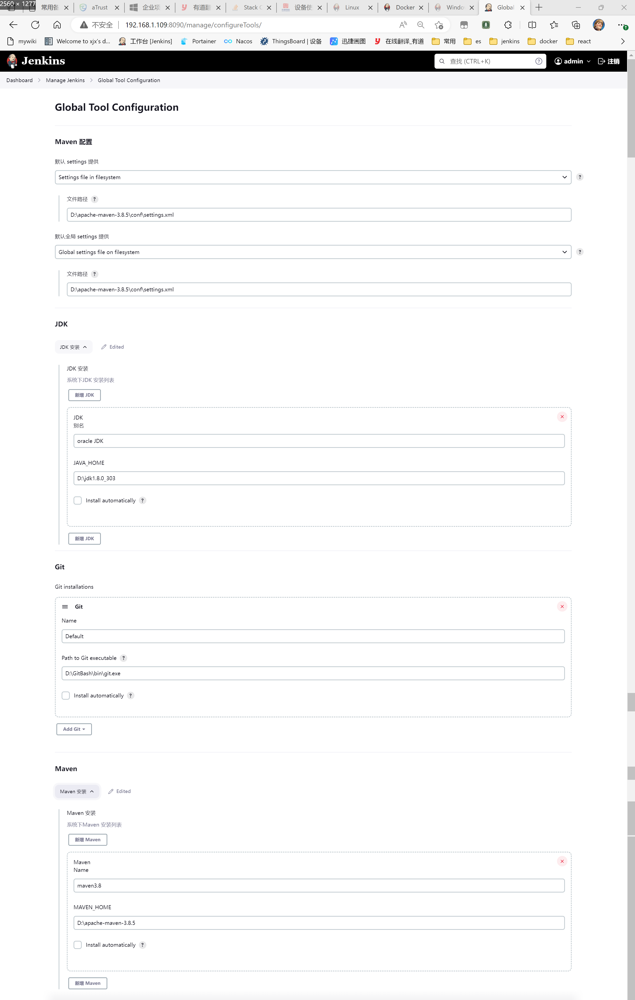
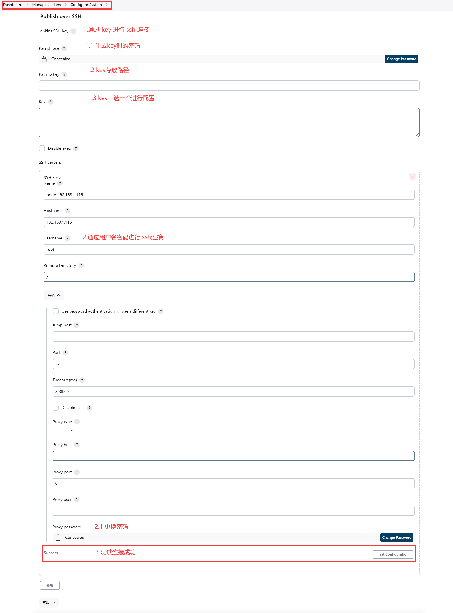

# ci-di

## 1 jenkins

### 1.1 环境搭建

1. 安装 [官方文档](https://www.jenkins.io/doc/book/installing/windows/)
2. 找到配置文件(端口 `JENKINS_HOME` 后续修改启动参数),参考官方文档,不同系统不一样
   1. Windows 在 `JENKINS_HOME` 同级目录
   2. Linux 查看 jenkins 服务: `/lib/systemd/system/jenkins.service` `usr/lib/systemd/system/jenkins.service`
   3. docker 对应启动参数
3. 全局工具配置:配成本机/宿主机上安装的即可

    <details>
      
    </details>

4. 插件下载
   1. Localization: Chinese (Simplified)
   2. Git Plugin
   3. Pipeline: Stage View
   4. Publish Over SSH:jenkins 主机作为 ssh 客户端连接应用节点服务器,配置如下。

      <details>
        
      </details>

### 1.2 使用心得

1. jenkins 工作方式
   1. 本机部署。任务从头到尾在 jenkins 本机/宿主机完成
   2. 节点部署。任务从头到尾在 jenkins 管理的节点完成
   3. 本机打包、节点运行。利用 jenkins 所在机器的全局工具进行项目的前期工作、通过 `Publish Over SSH` 插件将文件发送到应用节点运行
2. 两个 Jenkinsfile
   1. jenkins 安装在 windows,本机部署。

      ```groovy
        node {
          stage('Git') {
            git credentialsId: '5a305ccd-acf5-4aef-b510-82d052bb8985', url: 'http://admin@192.168.1.109:9090/r/GXC/GXC.git'
          }

          stage('stop') {
            def status = bat(returnStatus: true, encoding: 'utf8', script:
                '''
                    taskkill /f /im %model%.exe /T
                ''')
            if (status != 0) {
                bat ' echo "服务已关闭" '
            }
          }

          stage('Package') {
            if(model=="rail-auth" || model=="rail-gateway"){
                bat "mvn clean package -Dmaven.test.skip=true -pl ./%model%"
            }else{
                bat "mvn clean package -Dmaven.test.skip=true -pl ./rail-modules/%model%"
            }
          }

          stage('run') {
            bat '''
                    SCHTASKS /Delete /F /TN %model%
                    SCHTASKS /Create /F /RU SYSTEM /SC ONSTART /TN %model% /TR D:\\GXC_setup\\jenkins\\%model%.bat
                    SCHTASKS /RUN /TN %model%
                '''
          }
        }
      ```

   2. jenkins 安装在 windows,本机打包、linux 节点运行。

      ```groovy
        node {
          stage('Git') {
            git credentialsId: '5a305ccd-acf5-4aef-b510-82d052bb8985', url: 'http://admin@192.168.1.109:9090/r/ITIP/Itip.git'
          }

          stage('Package') {
            if(model=="itip-system" || model=="itip-file" || model=="itip-knowledge"){
                bat "mvn clean package -Dmaven.test.skip=true -pl ./itip-modules/%model%"
            }else if (model=="itip-auth" || model=="itip-gateway"){
                bat "mvn clean package -Dmaven.test.skip=true -pl ./%model%"
            }else{
                bat "mvn clean package -Dmaven.test.skip=true -pl ./itip-modules/itip-tpm/%model%"
            }
          }

          stage('run') {
            if(model=="itip-system" || model=="itip-file" || model=="itip-knowledge"){
                sshPublisher(publishers: [sshPublisherDesc(configName: 'node-192.168.1.116', transfers: [sshTransfer(cleanRemote: false, excludes: '', execCommand: '''cd /
                mv -f ./itip-modules/${model}/target/*.jar /usr/local/itip/${model}/lib
                cd /usr/local/itip
                docker compose up --build -d ${model}''', execTimeout: 120000, flatten: false, makeEmptyDirs: false, noDefaultExcludes: false, patternSeparator: '[, ]+', remoteDirectory: '/', remoteDirectorySDF: false, removePrefix: '', sourceFiles: 'itip-modules/${model}/target/*.jar')], usePromotionTimestamp: false, useWorkspaceInPromotion: false, verbose: true)])
            }else if (model=="itip-auth" || model=="itip-gateway"){
                sshPublisher(publishers: [sshPublisherDesc(configName: 'node-192.168.1.116', transfers: [sshTransfer(cleanRemote: false, excludes: '', execCommand: '''cd /
                mv -f ./${model}/target/*.jar /usr/local/itip/${model}/lib
                cd /usr/local/itip
                docker compose up --build -d ${model}''', execTimeout: 120000, flatten: false, makeEmptyDirs: false, noDefaultExcludes: false, patternSeparator: '[, ]+', remoteDirectory: '/', remoteDirectorySDF: false, removePrefix: '', sourceFiles: '${model}/target/*.jar')], usePromotionTimestamp: false, useWorkspaceInPromotion: false, verbose: true)])
            }else{
                sshPublisher(publishers: [sshPublisherDesc(configName: 'node-192.168.1.116', transfers: [sshTransfer(cleanRemote: false, excludes: '', execCommand: '''cd /
                mv -f ./itip-modules/itip-tpm/${model}/target/*.jar /usr/local/itip/itip-tpm/${model}/lib
                cd /usr/local/itip
                docker compose up --build -d ${model}''', execTimeout: 120000, flatten: false, makeEmptyDirs: false, noDefaultExcludes: false, patternSeparator: '[, ]+', remoteDirectory: '/', remoteDirectorySDF: false, removePrefix: '', sourceFiles: 'itip-modules/itip-tpm/${model}/target/*.jar')], usePromotionTimestamp: false, useWorkspaceInPromotion: false, verbose: true)])
            }
          }
        }
      ```

3. 本机或节点为 Windows 下的问题
   1. 中文乱码
   2. bat 命令错误整个部署报错 [参考官方例子](https://www.jenkins.io/blog/2017/07/26/powershell-pipeline/#using-microsoft-powershell-in-pipeline)

      >```groovy
      >  node {
      >    def status = powershell(returnStatus: true, script: 'ipconfig')
      >    if (status == 0) {
      >        // Success!
      >    }
      >  }
      >```

   3. 构建一结束进程就退出了 [从构建中生成进程](https://www.jenkins.io/doc/book/managing/spawning-processes/#sidebar-content) 专门讲了这个问题,针对 windows 提供了三种方式
      1. at 指令。这个指令已过时
      2. cscript 包装成脚本。
      3. SCHTASKS 指令包装成定时任务并立即执行。[微软 SCHTASKS 文档](https://learn.microsoft.com/zh-cn/windows-server/administration/windows-commands/schtasks)

          ```groovy
              stage('run') {
                bat '''
                        SCHTASKS /Delete /F /TN %model% 
                        SCHTASKS /Create /F /RU SYSTEM /SC ONSTART /TN %model% /TR D:\\GXC_setup\\jenkins\\%model%.bat
                        SCHTASKS /RUN /TN %model% 
                    '''
              }
          ```
