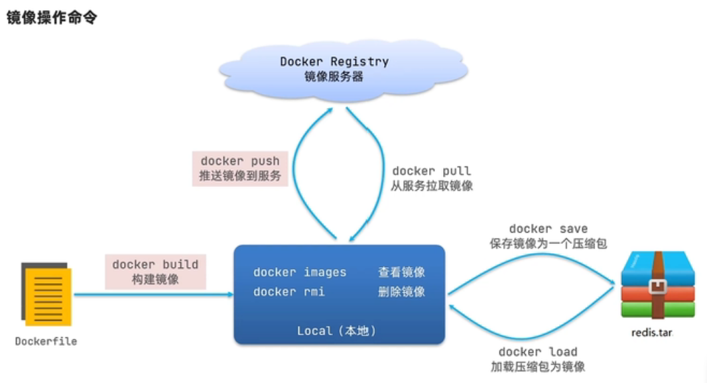
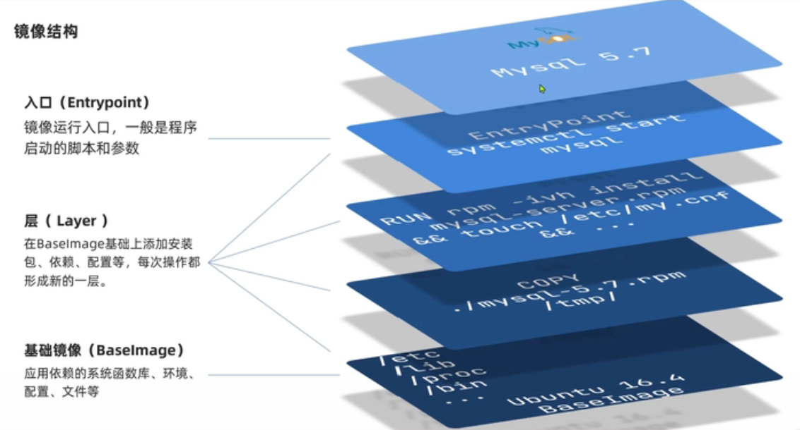
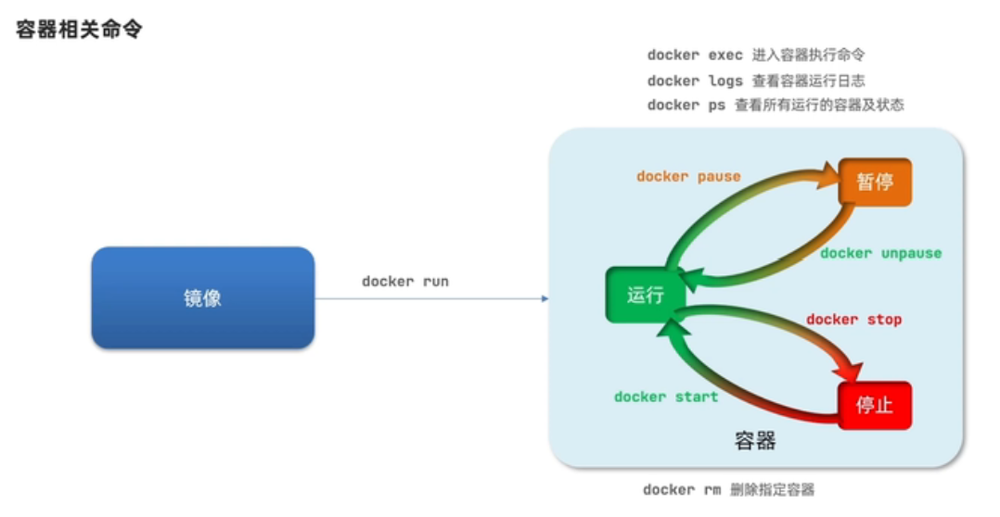
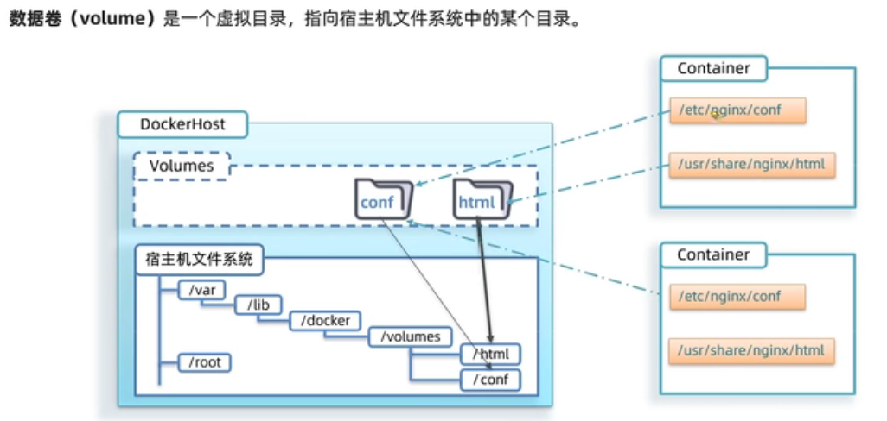

# docker

## 1 概述

- 历史
- 对比虚拟机

## 2 安装

- [官方文档](https://docs.docker.com/get-docker/)

- 以 Windows 为例
  - 下载 windows 版 Docker Desktop 的安装包
  - 确认CPU已经开启虚拟化功能:任务管理器 性能 页面；未开启的自行开启，可以参考[各机型开启VT](https://www.omicsclass.com/article/367)
  - 启用Hyper-V:搜索打开 启用或关闭Windows功能 ；如果没有Hyper-V选项，先执行<a href="../../_static/bin/hyper-v.cmd" target="_blank" download="hyper-v.cmd">脚本</a>
  - 运行安装程序
  - 设置阿里镜像：[个人控制台](https://cr.console.aliyun.com)拿到个人加速地址，启动docker打开设置将地址填入`"registry-mirrors"`下即可。
  - `cmd`下即可运行相关命令，如查看版本`docker -v` `docker-compose -v`

## 3 使用

- **3.1 镜像、容器、数据卷**  [官方文档](https://docs.docker.com/)

 <center class="half">
 
 </center>
  <center class="half">
 
 </center>

- **3.2 Dockerfile** 用于自定义镜像。 主要指令：`FROM` `ENV` `COPY` `RUN` `EXPOSE` `ENTRYPOINT`

 ```dockerfile
 # 指定基础镜像
 FROM ubuntu:16.0.4
 # 配置环境变量，JDK安装目录
 ENV JAVA_DIR=/usr/local
 # 拷贝JDK,项目JAR包到镜像内
 COPY ./jdk.jar.gz $JAVA_DIR
 # 安装JDK: 解压缩、重命名
 RUN cd $JAVA_DIR \
     && tar -xf ./jdk.jar.gz \
     && mv ./jdk1.8.0_144 ./java8
 # 配置环境变量
 ENV JAVA_HOME=$JAVA_DIR/java8
 ENV PATH=$PATH:$JAVA_HOME/bin

 ## 由于是分层结构，可以直接从java镜像开始构建，效果是一样的
 #FROM java:8-alpine

 # 拷贝JDK,项目JAR包到镜像内
 COPY ./docker-demo.jar /tmp/app.jar
 # 暴露端口
 EXPOSE 8090
 # 入口，启动 JAVA项目
 ENTRYPOINT java -jar /tmp/app.jar
 ```

 ```bat
 docker build -t pwmis-webapi:1.0 -f Dockerfile .
 ```

- **3.3 DockerCompose**
  - 镜像仓库搭建

  ```text
  version: '3.0'
  services:
   registry:
    image: registry
    volumes:
     - D:\dockervolumes\registry:var/lib/registry
   ui:
    image: joxit/docker-registry-ui
    ports:
     - 8086:80
    environment:
     - REGISTRY_TITLE=我的私有仓库
     - REGISTRY_URL=http://registry:8086
    depends-on:
     - registry
  ```
