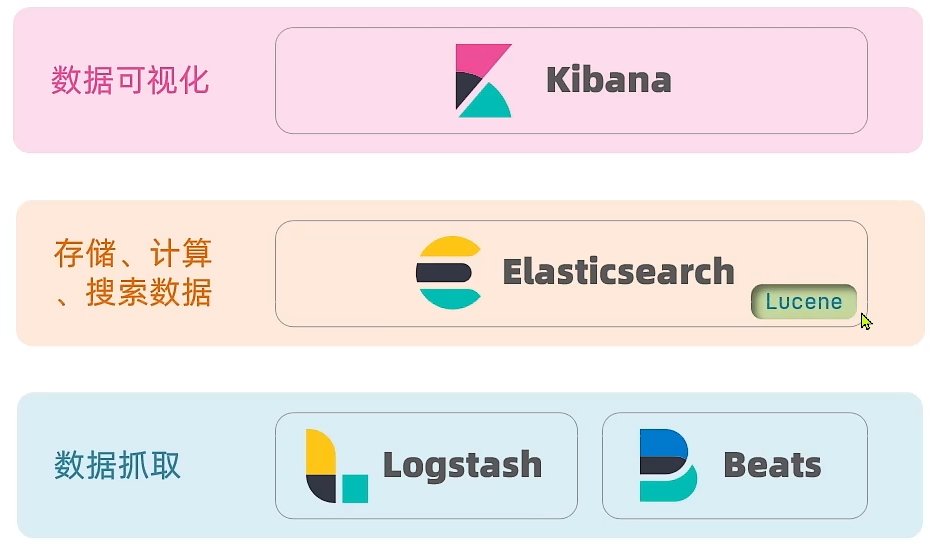
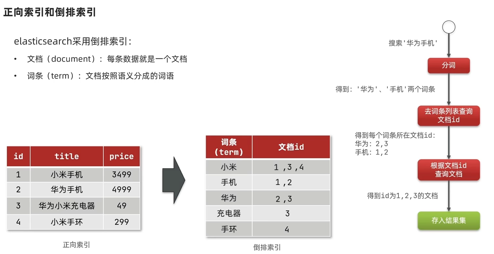
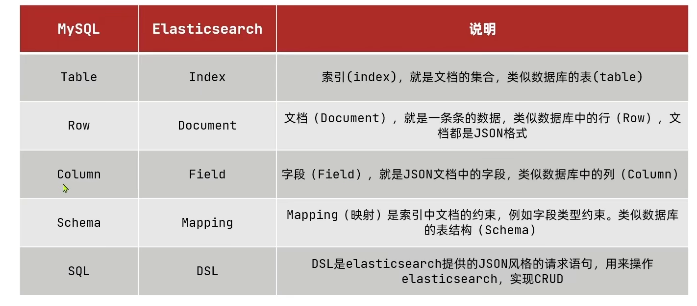
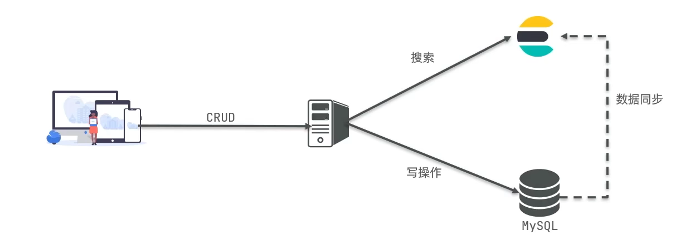

# elasticsearch

## 1 概述

es是一款非常强大的开源搜索引擎，结合kibana、Logstash、Beats，称为elastic stack(ELK),被广泛应用在日志数据分析、实时监控等领域。
 

- **1.1 历史**
  - Lucence是一个JAVA语言的搜索引擎类库，是Apache公司的顶级项目，由DougCutting于1999年开发，[Lucence官网](https://lucene.apache.org/)
    - 优点：高性能(基于倒排索引)、易扩展(作为一个类库)
    - 缺点：仅限于JAVA语言、不支持水平扩展
  - 2004年shay Banon基于Lucence开发了Compass; 2010年shay Banon重写了Compass,取名为elasticsearch；es的优点
    - 可水平扩展(支持分布式)
    - 提供Restful接口，可被任何语言调用
- **1.2 倒排索引**
     
- **1.3 对比 Mysql**
     
  - mysql擅长事务类型操作，可以确保数据的安全和一致性。
  - es擅长海量数据的搜索、分析、计算
  - 二者不是替代的关系，应该说是互补的关系，常见应用场景：
     

## 2 安装:基于 Docker

- **2.1 安装 es**
  - 首先创建一个网络，与 kibana 容器互联需要

  ```bat
  docker network create es-net
  ```

  - 从镜像仓库拉取镜像并启动容器，等待容器启动结束，成功访问[9200端口](http://localhost:9200/)即可。由于是 cmd 命令，换行符为 `^`
  
  ```bat
  docker pull elasticsearch:7.12.1

  docker run -d ^
   --name es ^
   -e "ES_JAVA_OPTS=-Xms512m -Xmx512m" ^
   -e "discovery.type=single-node" ^
   -v D:\dockervolumes\es\es-data:/usr/share/elasticsearch/data ^
   -v D:\dockervolumes\es\es-plugins:/usr/share/elasticsearch/plugins ^
   --privileged ^
   --net es-net ^
   -p 9200:9200 ^
   -p 9300:9300 ^
  elasticsearch:7.12.1
  ```

  - 若无法访问或需要认证，需要修改配置文件启动，为方便修改，先把 config 文件夹从复制到宿主机`docker cp 容器名：容器中路径 宿主机路径`

  ```bat
  docker cp es:/usr/share/elasticsearch/config D:\dockervolumes\es
  ```

  - 修改宿主机 elasticsearch.yml ,增加一行

  ```js
  xpack.security.enabled: false
  ```

  - 新增挂载宿主机配置文件夹运行

  ```bat
  docker run -d ^
   --name es ^
   -e "ES_JAVA_OPTS=-Xms512m -Xmx512m" ^
   -e "discovery.type=single-node" ^
   -v D:\dockervolumes\es\es-data:/usr/share/elasticsearch/data ^
   -v D:\dockervolumes\es\es-plugins:/usr/share/elasticsearch/plugins ^
   -v D:\dockervolumes\es\config:/usr/share/elasticsearch/config ^
   --privileged ^
   --net es-net ^
   -p 9200:9200 ^
   -p 9300:9300 ^
  elasticsearch:7.12.1
  ```

- **2.2 安装 kibana**

  - 从镜像仓库拉取镜像并启动容器，等待容器启动结束，成功访问[5601端口](http://localhost:5601/)即可。kibana 版本需要与 elasticsearch 保持一致

  ```bat
  docker pull kibana:7.12.1

  docker run -d ^
   --name kibana ^
   -e ELASTICSEARCH_HOSTS=http://es:9200 ^
   --network=es-net ^
   -p 5601:5601  ^
  kibana:7.12.1
  ```

- **2.3 安装 IK分词器**

  推荐离线安装：[ik分词器git仓库](https://github.com/medcl/elasticsearch-analysis-ik)

  - 下载相同版本的压缩包解压到宿主机挂载的文件下`D:\dockervolumes\es\es-plugins\ik`
  - 满足仓库 ReadMe 中大版本对应的情况下，没有相同的小版本时重启 es 会报错
  - 需要修改解压后的 `ik\plugin-descriptor.properties`, 把小版本号改成与 es 相同
  
  ```js
  elasticsearch.version=7.12.1
  ```

  - 字典扩展和停用
    - 修改解压后的 `ik\config\IKAnalyzer.cfg.xml`, 指定对应字典文件

    ```xml
     <!--用户可以在这里配置自己的扩展字典 -->
     <entry key="ext_dict">ext.dic</entry>
     <!--用户可以在这里配置自己的扩展停止词字典-->
     <entry key="ext_stopwords">stopword.dic</entry>
    ```

    - 新建字典文件，stopword.dic 已经存在；按需要添加单词即可
    - 重启 es 生效

- **2.4** [Windows安装es](https://blog.csdn.net/weixin_39370907/article/details/99974710)

## 3 DSL

使用 kibana 提供的 dev tools 进行测试、学习; [官方文档](https://www.elastic.co/guide/en/elasticsearch/reference/current/index.html)

- **3.1 索引库**
  - 常用属性
    - properties: 子字段
    - type: 数据类型
    - index: 是否创建倒排索引, 默认 true
    - analyzer: 分词器
  - 其中 type 属性的常见类型
    - 字符串: text、 keyword(不分词)
    - 数字: long、 integer、 short、 byte、 double、 float
    - 布尔: boolean
    - 日期: date
    - 对象: object
  - 创建索引库: `PUT /索引库名`
  
  ```js
  PUT /hotel
  {
    "mappings": {
      "properties": {
        "id": {
          "type": "keyword"
        },
        "name":{
          "properties": {
            "firstName": {
              "type": "keyword",
           "copy_to": "all"
            },
            "lastName": {
              "type": "keyword",
           "copy_to": "all"              
            }
          }
        },
        "address":{
          "type": "keyword",
          "index": false
        },
        "price":{
          "type": "integer"
        },
        "brand":{
          "type": "keyword",
          "copy_to": "all"
        },
        "location":{
          "type": "geo_point"
        },
        "all":{
          "type": "text",
          "analyzer": "ik_max_word"
        }
      }
    }
  }
  ```

  - 查询索引库: `GET /索引库名`
  - 删除索引库: `DELETE /索引库名`
  - 修改索引库: `PUT /索引库名/_mapping` (仅允许新增字段，不允许修改)

- **3.2 文档操作**
  - 插入文档： `POST /索引库名/_doc/文档id` (若不指定文档id,会自动生成,不推荐)
  - 查询文档： `GET /索引库名/_doc/文档id`
  - 删除文档： `DELETE /索引库名/_doc/文档id`
  - 修改文档-全量修改： `PUT /索引库名/_doc/文档id`  (先删除后增,可做插入语句用)
  - 修改文档-局部修改： `POST /索引库名/_update/文档id`  (修改指定字段)
- **3.3 查询**

 ```js
 GET /indexName/_search
 {
  "query":{
   "查询类型":{
    "查询条件": "条件值"
   }
  }
 }
 ```

- 查询所有 `match_all`
- 全文检索 `match`  `multi_match`
  - 将多个字段利用`copy_to`复制到了`all`字段中，则根据三个字段搜索，和根据`all`字段搜索效果是一样的
  - 搜索字段越多，对查询性能影响越大，建议采用`copy_to`将多个字段合并为一个，然后使用单字段查询的方式。
- 精确查询
  - `term` 根据词条精确匹配，一般搜索 keyword 类型、数值类型、布尔类型、日期类型字段
  - `range` 根据数值范围查询，可以是数值、日期的范围
- 地理查询 `geo_bounding_box`  `geo_distance`
- 复合查询 `bool`
  - `must` 必须匹配的条件，可以理解为**“与”**
  - `should` 选择性匹配的条件，可以理解为**“或”**
  - `must_not` **不参与打分**，必须不匹配的条件，可以理解为**“非”**
  - `filter` **不参与打分**，必须匹配的条件，可以理解为**“与”**
- **3.4 相关性算分**
  
  ```js
  GET /indexName/_search
  {
    "query": {
      "function_score": {
        "query": {  .... }, // 原始查询，得到原始算分
        "functions": [ 
          {
            "filter": {  .... }, // 过滤条件，哪些文档需要计算额外算分，得到函数算分
            "算分函数": "表达式" 
          }
        ],
        "boost_mode": "运算模式" // 原始算分和函数算分做何种运算得到最终结果
      }
    }
  }
  ```

  - 算分函数
    - `weight` 指定常量
    - `field_value_factor` 以文档中的某个字段值作为函数结果
    - `random_score` 以随机数作为函数结果
    - `script_score` 自定义算分函数算法
  - 运算模式 `multiply` `replace` `sum` `avg` `max` `min`
  
- **3.5 结果处理: 排序、分页、高亮**
  - 默认按算分结果排序，指定排序字段之后就不再做相关性算分了
  - 分页查询方案
    - from + size: 支持随机翻页;深度分页问题，默认查询上限（from + size）是10000
    - after search: 没有查询上限（单次查询的size不超过10000）;只能向后逐页查询
    - scroll: 没有查询上限（单次查询的size不超过10000）;会有额外内存消耗，并且搜索结果是非实时的
  
  ```js
  GET /hotel/_search
  {
    "query": {...},
    "from": 0, // 分页开始的位置，默认为0
    "size": 10, // 期望获取的文档总数
    "sort": [
      "FIELD": "desc"  // 排序字段、排序方式ASC、DESC
    ],
    "highlight": {
      "fields": { // 指定要高亮的字段
        "FIELD": {
          "pre_tags": "<em>",  // 用来标记高亮字段的前置标签
          "post_tags": "</em>" // 用来标记高亮字段的后置标签
          "required_field_match": "false" // 对非搜索字段高亮
        }
      }
    }
  }
  ```

- 数据聚合
- 自动补全

## 4 RestClient

- [Java High Level REST Client](https://www.elastic.co/guide/en/elasticsearch/client/java-rest/current/java-rest-high.html)

## 5 搭建知识库

- 数据导入
- 数据同步
- 集群搭建
