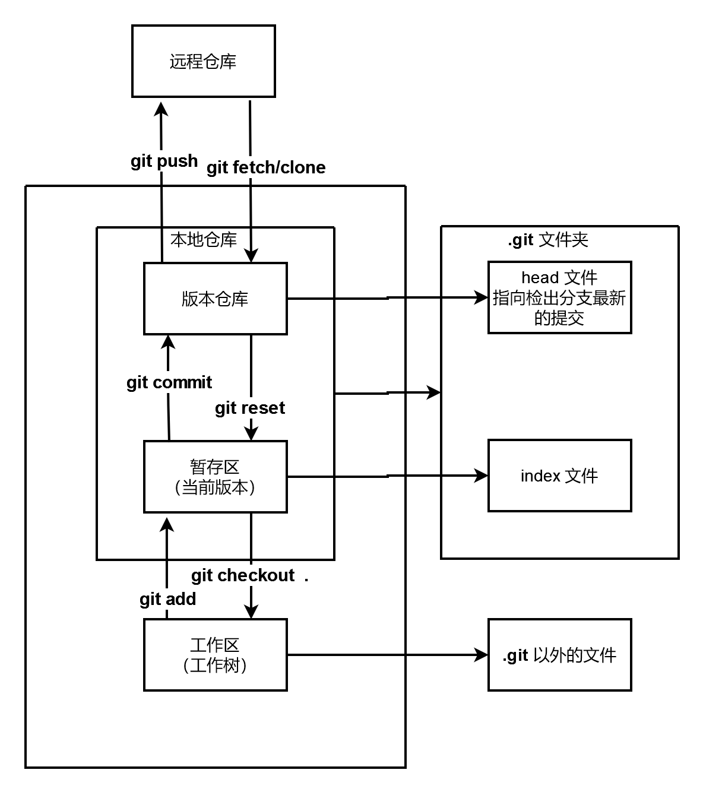
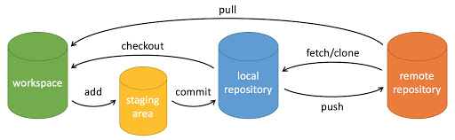
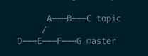
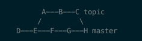
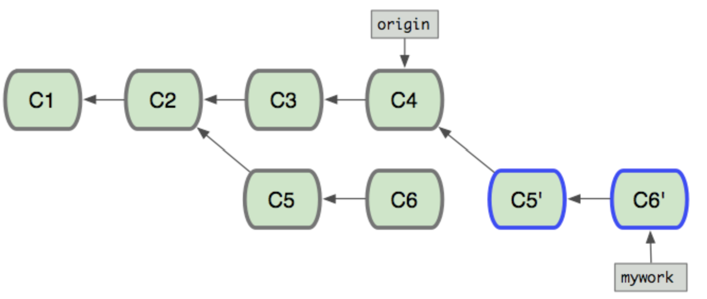

# git

## 1. 版本控制

- 本地版本控制

>**版本仓库**仅有一份;并且同一时间仅允许一个人对版本做读写操作。

- 集中版本控制

>**版本仓库**仅有一份，一般存放在服务器;同一时间内允许多人读取**版本仓库**中最新版本并在本地自行修改;提交更新时解决冲突。<br>
>这种解决方案，如果服务器出问题，**版本仓库**丢失，历史版本也就丢失了。<br>
>代表产品：svn

- 分布式版本控制

>**版本仓库**在本地和服务器上同时存在;在没有网络的情况下，本地可以实现版本控制；联网时可以提交到服务器，同时解决冲突。<br>
>代表产品：git

## 2. 安装

- 参考 [菜鸟教程](https://www.runoob.com/git/git-install-setup.html)

## 3. 工作原理

<!--  -->
<!--  -->


## 4. 常用命令

- 创建仓库
	+ `git init`
	
		```
		git init
		git add README.md
		git commit -m "first commit"
		git branch -M main
		git remote add origin git@github.com:zzpandaman/test.git
		git push -u origin main
		```

	+ `git clone`
		* 本地的master分支自动追踪origin/master分支
		* 手动建立追踪关系`git branch --set-upstream-to=origin/test test `
		* 追踪关系查看`git branch -vv`
		
- 工作流程
	* `git pull <远程主机名> <远程分支名>:<本地分支名>`:使用给定的参数运行`git fetch`，并调用`git merge`将检索到的分支头合并到当前分支中。
		* 实际是组合命令
		
			```
			git pull origin master:master		//等价于

			git fetch origin master:master
			git merge origin/master
			```
	
		* 参数省略:最简变成`git pull`
			- 与当前分支合并，省略本地分支名
			- 如果当前分支与远程分支存在追踪关系，git pull就可以省略远程分支名
			- 如果当前分支只有一个追踪分支，连远程主机名都可以省略。
		* 添加参数`--rebase`：运行`git rebase`而不是`git merge`
		
	+ `git fetch <远程主机名> <远程分支名>:<本地分支名>`
		* 如果本地分支不存在, 则会自动创建,但不会自动切换
	+ `git merge`
	
		<center class="half">
		
		</center>

		* `git pull`中的合并操作: 以在main分支为例，`git fetch`执行后使用`git branch -vv`可以看到main分支落后origin/main，因此需要合并操作。
		
	+ `git rebase`
		
		```
		git checkout mywork
		git rebase origin
		```

		

	+ `git add`
	+ `git commit -m`: 执行前强烈建议先查看状态。
	+ `git push <远程主机名> <本地分支名>:<远程分支名>`
		
		```
		git push origin :master 	// 等同于
		
		git push origin --delete master
		```

	+ `git checkout`
		* `git checkout .`或`git checkout -- <file>`：用暂存区全部或指定的文件替换工作区的文件，会**清除工作区中未添加到暂存区中的改动**。
		* `git checkout HEAD .`或`git checkout HEAD <file>`：用分支中的全部或者部分文件替换暂存区和以及工作区中的文件，会**清除工作区中未提交的改动**以及**暂存区中未提交的改动**。
	+ `git reset`：回朔到指定的commit版本，指定的commit版本之后的操作commit都重置了。三种工作模式如下：
		* `--soft`: 会仅仅重置HEAD到制定的版本，保留index和working tree
		* `--mixed`: 缺省模式。重置HEAD到制定的版本，修改index;保留working tree
		* `--hard`: 重置HEAD到制定的版本，修改index和working tree
		
		```
		git reset –hard HEAD~3  # 回退上上上一个版本  
		git reset –hard 052e           # 回退到指定版本
		git reset --hard origin/master    # 将本地的状态回退到和远程的一样
		```

	+ `git revert`：删除指定的commit操作的内容，指定的commit之前和之后commit操作都不受影响，与此同时这个操作也会作为一个commit进行提交。
	
- 查看状态、提交记录、分支情况
	+ `git status -s`:用于显示工作目录和暂存区的状态。分为三大类：
		* *Changes to be committed*: 已经在stage区, 等待添加到HEAD中的文件
		* *Changes not staged for commit*: 有修改, 但是没有被添加到stage区的文件
		* *Untracked files*: 没有tracked过的文件, 即从没有add过的文件
	+ `git log --graph`
	+ `git branch -a -vv`
- 分支管理

	```cmd
	git branch -a -vv	//查看信息
	git branch new_branch_name	//新建分支
	git branch -d branch_name 	//删除指定分支 -D ：强制删除
	git branch -m old_name new_name 	//修改分支名字
	git checkout branch_name 	//切换到指定分支
	git checkout -b new_branch_name 	//组合操作：创建新分支并切换
	git branch --set-upstream-to=origin/test test  //建立追踪关系
	```

	`git checkout`切换分支时，工作区和暂存区有新增文件可以切换，这些新增文件会被带到新分支。<br>
	如果有未commit的修改不允许切换，需执行`git commit`或`git stash`

- 远程操作

	```cmd
	git remote add origin ssh://git@192.168.1.112:8010/root/wiki.git
	git remote rm origin
	git remote rename old_name new_name
	```

- [git最佳实践](https://zhuanlan.zhihu.com/p/349805087)
- 常见问题
	+ 冲突解决
		* 场景1：本地有未commit的改动，执行`git pull`报错。
			- 保存改动的做法1：直接commit,执行`git pull`后手动解决冲突。
			- 保存改动的做法2：`git stash pop`之后再手动解决冲突
			
				```
				git stash
				git pull
				git stash pop
				git stash list
				git stash drop
				```

			- 放弃改动的做法：`git reset --hard`
			
		* 场景2：`git merge`后手动解决冲突。然后执行`git add .` `git commit`
		* 场景3：`git rebase`后手动解决冲突。然后执行`git add .` `git rebase --continue`

	+ .gitignore 配置失效
	
	```cmd
	git rm -r --cached .
	git add .
	git commit -m "update .gitignore"
	git push -u origin master
	```

	+ 多ssh-key配置
	
		+ git bash运行如下命令，在~/.ssh路径下，生成多个ssh-key
	
		```cmd
		ssh-keygen -t rsa -C '[邮箱]' -f ~/.ssh/github_id_rsa
		ssh-keygen -t rsa -C '[邮箱]' -f ~/.ssh/gitlab_id_rsa
		```
	
		+ 在~/.ssh路径下，新建配置文件config
	
		```txt
		# github
		Host github.com
		HostName github.com
		PreferredAuthentications publickey
		IdentityFile ~/.ssh/github_id_rsa
		
		# gitlab
		Host gitlab.com
		HostName gitlab.com
		PreferredAuthentications publickey
		IdentityFile ~/.ssh/gitlab_id_rsa
		
		# 如果生成多个 SSH-Key , 则按上面的格式继续往下写
		```


