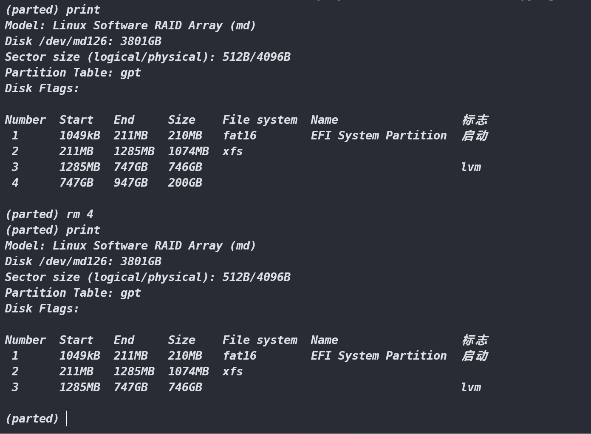

# linux

## 1 前世今生

## 2 一次安装经历 (硬盘4T gpt+UEFI)

[参考文章](https://blog.csdn.net/weixin_44934909/article/details/125033403)

[用到的资源](https://pan.baidu.com/s/1mGbufc1_E8pmhFcvVoKuFw?pwd=vjkc "提取码：vjkc")

### 2.1 下载对应镜像 [centos官网下载页](https://www.centos.org/download/)

### 2.2 制作U盘启动盘 [UltralSO官网下载页](https://cn.ultraiso.net/xiazai.html)

### 2.3 设置U盘开机启动(不同机器不一样) [华硕参考](http://www.xiaobaixitong.com/sysm/upqd/31778.html)

   1. 进入BIOS
   2. 关闭 `secure boot` 选项
   3. 开启 `Launch CSM` 选项
   4. 将U盘设为第一个启动项

### 2.4 进入图形安装界面前的操作

   1. 进入安装界面，光标打到 `Install CentOS 7`, 按 e 进入编辑模式
   2. 将系统镜像默认路径`hd:LABEL=CentOS\x207\x20x86_64` 改为 `hd:LABEL=Linux dd quit`
   3. ctrl+X 运行桌面会打印正确的镜像路径,类似 `CentOS\x207\x20x8`
   4. ctrl+alt+del 重启后重复上述步骤修改为正确镜像路径后运行即可进入图形安装界面

### 2.5 装机后没有网络,需激活网卡

   ```sh
   # 文件名可能不一样
   vim /etc/sysconfig/network-scripts/ifcfg-ens33
   # ONBOOT=no 修改为 ONBOOT=yes
   ONBOOT=yes
   # 重启网络服务
   service network restart
   # 重启之后该文件中应该有Ip了,可以按上述步骤修改
   ```

### 2.6 装机后磁盘和分区情况(验证 UEFI 及安装步骤中的自定义分区)

   1. `lsblk` 查看磁盘和分区、挂载情况

      <details>
         
      </details>

      - 可以看出磁盘为 raid5 阵列，由 `mdadm` 进行分区管理，`lvm` 进行逻辑卷管理
      - 明显的uefi分区结构
        - md126p1 200M 作为 efi 分区,文件系统一定是 `FAT` (后面的命令中可以看到),存放引导程序等
        - md126p2 1G 作为 boot 分区,存放操作系统
        - md126p3 507.8G 作为 centos 文件分区,被 `lvm` 分为5个 `lv(Logic Volume)` 挂载到不同的目录或作为交换区
      - 整个磁盘 md126 还有很多空间没有用起来
   2. `df -hT` 查看文件系统、使用率、挂载情况

      <details>
         
      </details>

      - 验证了分区 md126p1 的文件系统为 `FAT`
   3. `pvs vgs lvs` 查看现有的 `lvm` 管理情况 [LVM参考](https://blog.csdn.net/weixin_42915431/article/details/121881054)

      <details>
         
      </details>

      - 磁盘 (md126)
      - 分区 (md126p1 md126p2 md126p3)
      - 物理卷 PV (由 `pvs` 结果可以看出目前只有分区 md126p3 被 `lvm` 当做 pv 管理起来了,且归属于名为 centos 的 VG)
      - 卷组 VG (由 `vgs` 结果可以看出仅有一个名为 centos 的 VG,它由1个 PV 组成,基于该组别映射了5个 LV)
      - 逻辑卷 LV (由 `lvs` 结果可以看出5个 LV 的名字,且都归属于名为 centos 的 VG)
      - 文件系统(结合 `df -hT` 的结果看出文件系统可以直接按分区设置,亦可基于 LV 设置)
   4. `parted /dev/md126` 进入交互模式对整个磁盘 md126 进行分区管理

      <details>
         
      </details>

      1. `help` 可以查看可以使用的指令
      2. `print` 可以查看各分区起始位置、大小、文件系统类型等信息

         <details>
            
         </details>

         - 可以看出逻辑分区为 512B ,物理分区为 4K(需要对齐分区保证读写效率 )
      <a id="jump_1"></a>
      3. `resizepart NUMBER END` 可以重新设置分区结束位置改变分区大小(如果新的分区结束位置在现有其他分区内时会出错)

         <details>
            
         </details>

      4. `align-check TYPE(min|opt) N` 检查分区是否对齐

         <details>
            
         </details>

      5. `quit` 退出parted交互模式使用 `lsblk` `pvs` 查看刚刚的分区扩容

         <details>
            
         </details>

         - 结果看出分区扩容结果直接反应到 `lsblk` 指令,而无法立即影响基于分区的 lvm
         - `pvresize /dev/md126p3` 将分区大小改变结果传递给 pv(对现有文件目录无影响)

            <details>
               
            </details>

      6. `parted /dev/md126` 重新进入交互模式并使用 `mkpart` 创建新分区

         <details>
            
         </details>

         - 可以看出 `mkpart` 也支持交互模式,且除了分区起始位置、分区大小均有缺省值
         - 分区起始位置错误会有提示,分区没有对齐也会有提示,选择 cancel 可以放弃该次新建分区

      7. 可以 `quit` 退出parted交互模式使用 lvm 相关命令将新分区交由 lvm 管理(只做扩容没必要新建分区)
         - 原则1: 只做扩容操作,不做删除操作
         - 原则2: 加的时候 pv -> vg -> lv -> 挂载目录; 删的时候 解挂目录 -> lv -> vg -> pv
         - 原则3: 删的时候先判断是否已挂载目录, 已挂载目录的 解挂 重新挂载 都需要备份防止数据丢失
      8. 基于原则1,扩容不需要新建分区，给[分区扩容](#jump_1)即可。`rm NUMBER` 删除刚刚新建的分区

         <details>
            
         </details>

## 3 常用软件装机

1. kafka
   1. [官方下载页](https://kafka.apache.org/downloads)
   2. [官方QUIKSTART](https://kafka.apache.org/quickstart)
   3. 修改配置

      ```sh
         # 1 zookeeper配置
         vim /usr/local/kafka_2.13-3.3.2/config/zookeeper.properties
         # 1.1 修改日志路径(在 tmp 下可能存在问题)
         log.dirs=/usr/local/kafka_2.13-3.3.2/tmp/kafka-logs         
         
         # 2 kafka配置
         vim /usr/local/kafka_2.13-3.3.2/config/server.properties
         # 2.1 修改日志路径(在 tmp 下可能存在问题)
         dataDir=/usr/local/kafka_2.13-3.3.2/tmp/zookeeper
         # 2.2 ip访问(替换 your_ip)
         listeners=PLAINTEXT://0.0.0.0:9092
         advertised.listeners=PLAINTEXT://your_ip:9092
      ```

   4. 打成Service

      ```sh
         cd /lib/systemd/system
         # 1.1 创建zookeeper的自启服务脚本
         vim zookeeper.service
         # 1.2 服务脚本zookeeper.service内容
         [Unit]
         Description=zookeeper service
         After=network.target 
            
         [Service] 
         Type=simple
         ExecStart=/usr/local/kafka-3.1.0/bin/zookeeper-server-start.sh /usr/local/kafka-3.1.0/config/zookeeper.properties
         ExecStop=/usr/local/kafka-3.1.0/bin/zookeeper-server-stop.sh
         PrivateTmp=true 
            
         [Install] 
         WantedBy=multi-user.target

         # 2.1 创建kafka的自启服务脚本
         vim kafka3.service
         # 2.2 服务脚本kafka3.service内容
         [Unit]
         Description=kafka service
         After=network.target zookeeper.service #要在zookeeper启动之后启动
            
         [Service] 
         Type=simple 
         ExecStart=/usr/local/kafka-3.1.0/bin/kafka-server-start.sh  /usr/local/kafka-3.1.0/config/server.properties
         ExecStop=/usr/local/kafka-3.1.0/bin/kafka-server-stop.sh
         Restart=on-failure
            
         [Install] 
         WantedBy=multi-user.target
      ```

2. docker
   1. [官方教程](https://docs.docker.com/engine/install/centos/)
   2. [docker compose](https://docs.docker.com/compose/install/)
